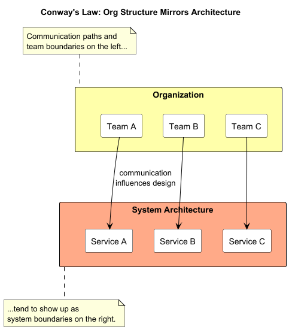
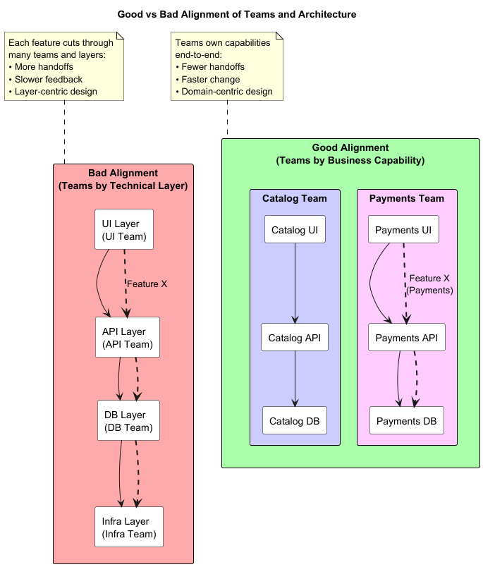
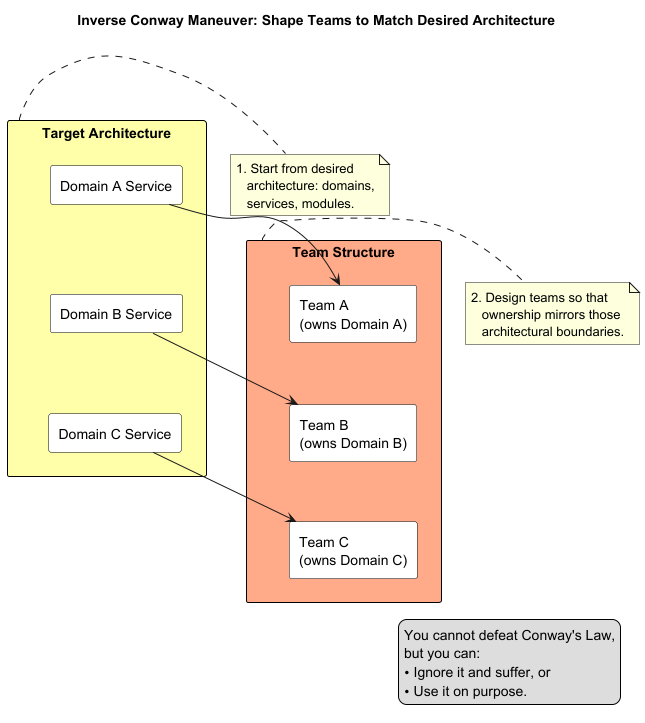
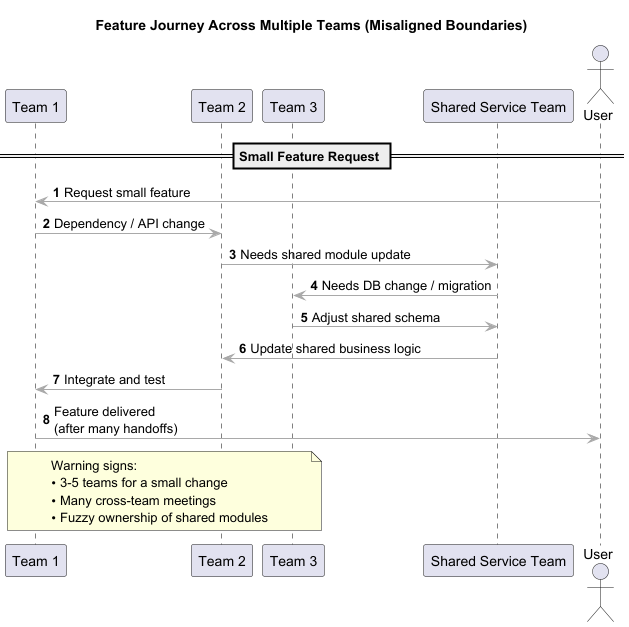
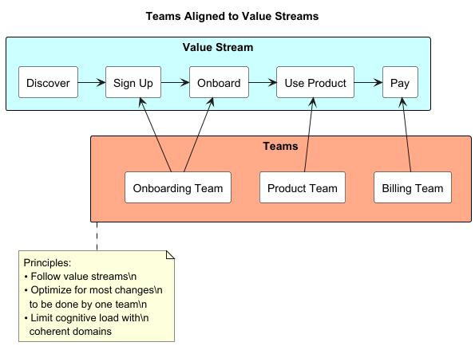
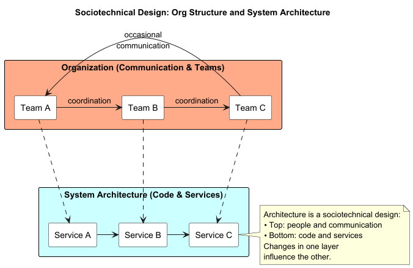

# Conway’s Law & Team Boundaries

Video: https://youtu.be/bRhvIO9fMzk

**Goals**

- Understand Conway’s Law at an architectural level
- See how org structure shapes system design
- Learn to use team boundaries *intentionally*
- Be aware of common risks and trade‑offs

---

# What Is Conway’s Law?

> “Organizations which design systems ...  produce designs which are copies of the communication structures of these organizations.”  
> — Melvin Conway, 1968

**Plain meaning**

- The way people and teams communicate  
  → shapes the architecture of the systems they build.
- Architecture is a **social artifact**, not just a technical one.

**Key idea**

- Show me your org chart and communication paths, and I can often predict your architecture.

---

# Why It Matters for Architecture

**Architecture mirrors:**

- Team boundaries
- Department and budget lines
- Time zones and locations
- Vendor and regulatory boundaries

**When misaligned:**

- Higher coordination cost
- Slower delivery and longer lead times
- Unclear ownership and blame shifting

--- 

# Why It Matters for Architecture (cont)

**When aligned:**

- Faster, safer changes
- Clear ownership of components
- Architecture that evolves more smoothly

---

# Good vs Bad Alignment

{width=50%}

**Good alignment**

- Teams ≈ **business capabilities** (e.g., Payments, Catalog, Onboarding)
- One team can:
    - Change “their” part mostly independently
    - Own availability, quality, and roadmap

**Bad alignment**

- Teams ≈ **technical layers** (e.g., UI, API, DB, Infra)
- Each feature requires many teams:
    - Lots of handoffs
    - Slow feedback loops
    - Architecture dominated by layers, not domain

---

# Inverse Conway Maneuver

**Definition**

- **Inverse Conway Maneuver**:  
  Design or adjust team structures so that the desired architecture **naturally emerges**.

**How to apply**

1. Envision target architecture (domains, services, modules).
2. Map ideal ownership (which team for which domain/bounded context).
3. Adjust teams and responsibilities accordingly.
4. Let communication patterns and code gradually realign.

---

# Inverse Conway Maneuver (cont)

**Important**

- You cannot “defeat” Conway’s Law.
- You can **either ignore it** or **use it on purpose**.

---

# Symptoms of Misaligned Boundaries

 
Look for these warning signs:

- A small feature requires **3–5 teams** to ship.
- Frequent cross‑team meetings for minor changes.
- “Shared” services or modules with fuzzy ownership.
- Roadmap conflicts over the same code or database areas.
- Architecture diagrams show clean domains,  
  but repos and services mirror old org charts.

---

# Designing Better Team Boundaries

**Principles**

- **Follow value streams**
    - Group teams around stable flows of work and business capabilities.
- **Optimize for change**
    - Aim for most changes to be done by **one team**.
- **Limit cognitive load**
    - Each team should own a coherent domain and a manageable set of systems.
- **Make interfaces explicit**
    - Clear APIs, events, and contracts between teams reduce ad‑hoc coordination.

---

# Using Conway’s Law in Practice

**When planning architecture**

- “Which team owns this component end‑to‑end?”
- “How many teams are involved in a typical feature?”

**When planning org changes**

- “What architecture will naturally emerge from this new structure?”
- “Are we creating bottlenecks or clarifying ownership?”

---

# Using Conway's Law in Practice (cont)

**When diagnosing pain**

- Slow delivery?
- Constant integration friction?
- Unclear ownership?  
  → Treat it as a **sociotechnical design issue**, not just a code problem.

---

# Key Takeaways

- System architecture tends to **mirror communication structures**.
- Team boundaries are **architectural decisions** in disguise.
- Use the **Inverse Conway Maneuver** to steer architecture via team design.
- Align teams with **business capabilities and bounded contexts**, not just layers.
- Watch symptoms of misalignment: coordination cost, confusion, and slow change.
- You are always designing **both** the system and the organization that builds it.