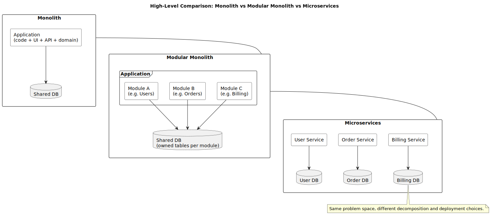
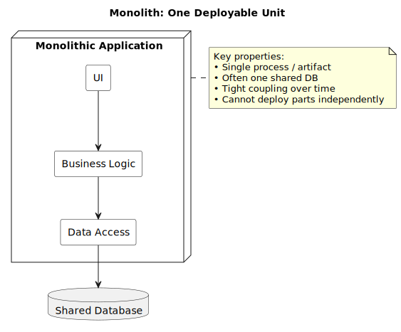
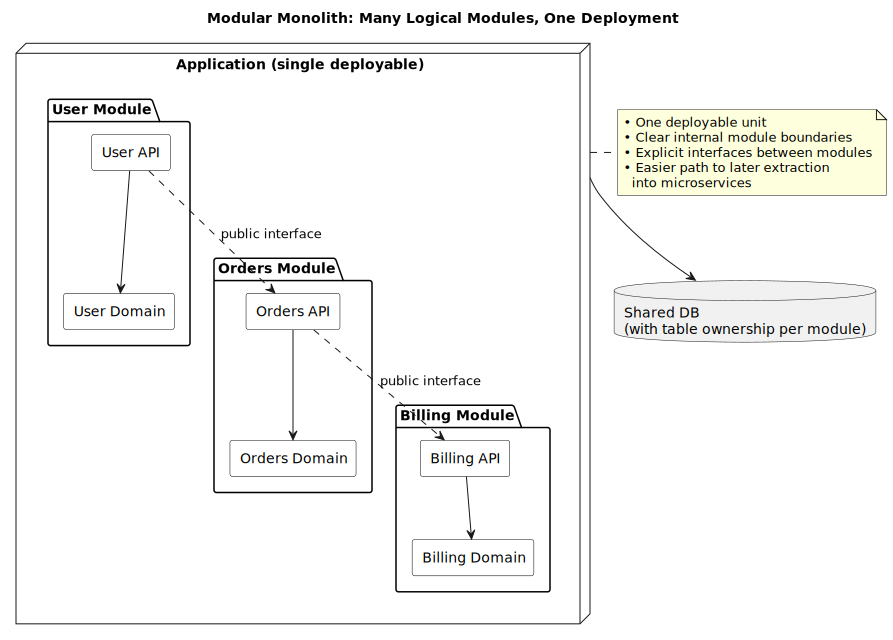
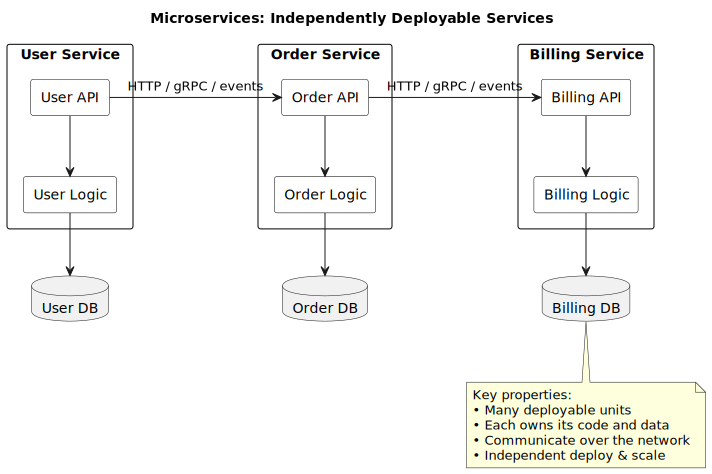
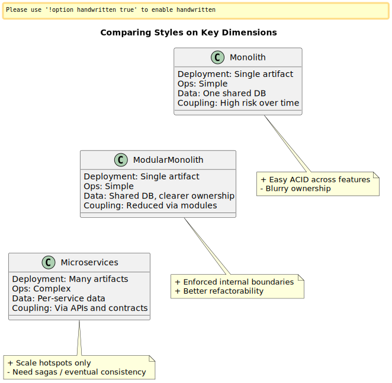
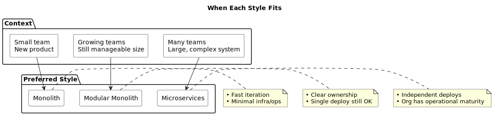
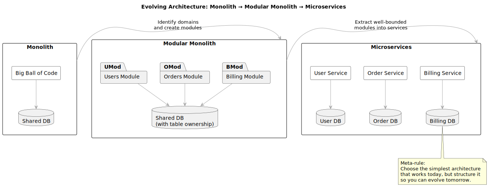

# Monolith vs Modular vs Microservices

Video: https://youtu.be/V_GqZK3H0gw

**Goals**

- Build a clear vocabulary for system decomposition
- Understand monolith, modular monolith, and microservices
- Recognize when each style fits
- Identify key risks and tradeoffs

---

# Why This Topic Matters

Modern systems outlive their original design:

- They grow in **features**, **teams**, and **traffic**
- Architecture that works for **1 team / 1 year** may fail for **5 teams / 5 years**
- "Let's use microservices" is often a slogan, not a reasoned decision

We’ll compare three styles:

1. **Monolith** – one deployable unit, tightly coupled codebase
2. **Modular monolith** – one deployable unit, strong internal module boundaries
3. **Microservices** – many deployable units, network-connected

Outcome: choose structure **based on context**, not fashion.

---

# Monolith

**Definition**

- Most or all code in a **single runtime unit**
- One process, one artifact, often one shared database
- Strong tendency toward **tight coupling** over time

**Key property**

> You can't deploy one part without deploying the whole.

**Pros**

- Simple deployment and operations
- Great for small teams and early-stage products
- Easy local development (one repo, one process)

**Cons**

- Can become a "**big ball of mud**" if not structured
- Harder to scale parts independently
- Refactoring risk grows with size

---

# Modular Monolith

**Definition**

- Still **one deployable unit**, but:
- Clear **internal modules** around business capabilities
- Explicit interfaces between modules
- Limited direct access to other modules' internals

Think of it as:

> "Many logical services, one physical deployment."

**Pros**

- Keeps monolith's operational simplicity
- Better maintainability and refactorability
- Clearer ownership and team boundaries inside one codebase
- Easier migration path to microservices later

**Cons**

- Still one failure and deployment unit
- Requires discipline to keep boundaries clean

---

# Microservices

**Definition**

- Multiple **independently deployable services**
- Own codebase, process/container
- Preferably own datastore / schema
- Communicate over the network
- HTTP/REST, gRPC, messaging, events

**Key property**

> Each service can be built, deployed, and scaled **independently**.

**Pros**

- Strong alignment with **team boundaries**
- Independent release cycles and scaling
- Potential for better fault isolation

**Cons**

- Much higher **operational complexity**
- Network failures, timeouts, retries, versioning
- Easy to create a slow, fragile "**distributed monolith**"

---

# Comparing on Key Dimensions

**Deployment & Ops**

- **Monolith / Modular**: single artifact, simpler ops, scale whole app
- **Microservices**: many artifacts, complex ops, scale hotspots only

**Code & Coupling**

- **Monolith**: risk of big ball of mud, hidden DB coupling
- **Modular Monolith**: explicit module boundaries, enforced contracts
- **Microservices**: physical separation, coupling via APIs and data contracts

**Data & Transactions**

- **Monolith**: one DB, easy ACID across features, blurry ownership
- **Modular Monolith**: one DB, clearer table ownership per module
- **Microservices**: per-service data, no easy distributed ACID, need sagas & eventual consistency

---

# When Each Style Fits

**Monolith**

- New product, **small team**, fast iteration
- Requirements changing rapidly
- Want minimal infra/ops overhead

**Modular Monolith**

- Multiple devs/teams, but:
- One deployment is still fine
- Want **clean architecture** and clearer ownership
- Might evolve to microservices later

**Microservices**

- Many teams needing **independent** deploys
- Large, complex system with distinct scaling needs
- Org has the **operational maturity** (CI/CD, observability, SRE-style practices)

---

# Common Pitfalls

- **Premature microservices**  
  Tiny team + many services = time spent on boilerplate and debugging, not features

- **Shared database microservices**  
  Multiple services directly share one schema → effectively a distributed monolith

- **Over-modularized monolith**  
  Hundreds of tiny modules with little business meaning → confusion and slowdown

**Guideline**

> Create boundaries around **business capabilities**, not just technical layers.

---

# Evolving Your Architecture

**Monolith → Modular Monolith**

- Identify major **domains** (users, billing, orders, catalog)
- Group code into domain modules
- Enforce rules about who can call whom

**Modular Monolith → Microservices**

- Choose a well-bounded, high-value module
- Expose a stable internal API, then move it out as a service
- Gradually repeat where benefits outweigh costs

**Meta-rule**

> Choose the **simplest architecture** that solves today's problems,  
> but design with enough **modularity** to evolve for tomorrow.