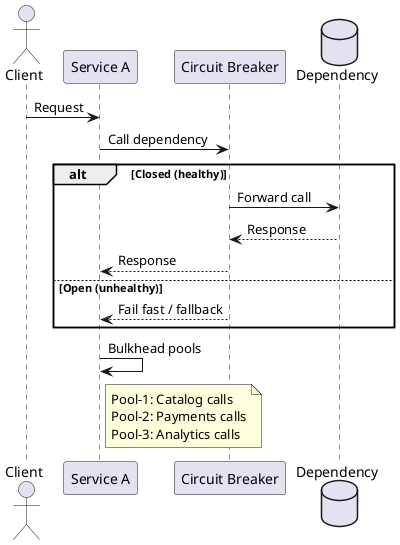

# Circuit Breakers and Bulkheads

**Outcomes**
- Explain circuit breakers and bulkheads at an architectural level
- Recognize when to apply each pattern
- Identify risks and tradeoffs

## Overview
Circuit breakers protect services from cascading failures by stopping calls to unhealthy dependencies. Bulkheads isolate resources so one failure or surge does not take down unrelated parts of the system. Together, they keep critical paths responsive under partial failure and allow the system to degrade gracefully.

## Why It Matters
In microservices, failures are normal: timeouts, slow dependencies, and network blips happen. Without protection, retries and thread exhaustion can cause a domino effect. Circuit breakers fail fast to protect upstream services, and bulkheads limit the blast radius by isolating capacity.

## Core Concepts
- Circuit breaker states: closed (normal), open (fail fast), half-open (probe recovery)
- Failure thresholds: error rate, timeout rate, or slow-call rate over a rolling window
- Bulkheads: separate pools of threads, connections, or queues per dependency or feature
- Fallbacks: provide degraded responses, cached data, or partial results
- Observability: track open/close events and failure rates to tune thresholds

## When to Use
- A dependency is flaky or has unpredictable latency
- One feature or dependency can overwhelm shared resources
- You need to keep core user flows responsive during partial outages

## Design Notes
- Use short timeouts and bounded retries before the breaker trips
- Keep bulkheads small and aligned to business-critical flows
- Prefer fast, safe fallbacks that do not call the failing dependency

## Diagram


## Example 1: Minimal Circuit Breaker (Pseudo)
```python
import time

class CircuitBreaker:
    def __init__(self, failure_threshold=5, reset_after_sec=30):
        self.failures = 0
        self.state = "CLOSED"
        self.opened_at = 0
        self.failure_threshold = failure_threshold
        self.reset_after_sec = reset_after_sec

    def allow(self):
        if self.state == "OPEN":
            if time.time() - self.opened_at > self.reset_after_sec:
                self.state = "HALF_OPEN"
                return True
            return False
        return True

    def record_success(self):
        self.failures = 0
        self.state = "CLOSED"

    def record_failure(self):
        self.failures += 1
        if self.failures >= self.failure_threshold:
            self.state = "OPEN"
            self.opened_at = time.time()
```

## Example 2: Bulkheads with Separate Pools
```python
from concurrent.futures import ThreadPoolExecutor

catalog_pool = ThreadPoolExecutor(max_workers=10)
payments_pool = ThreadPoolExecutor(max_workers=4)

# Isolated capacity so a slow payment gateway cannot block catalog lookups.
def fetch_catalog():
    pass

def charge_card():
    pass

catalog_pool.submit(fetch_catalog)
payments_pool.submit(charge_card)
```

## Architectural Tradeoffs
- Scalability: bulkheads improve horizontal scale by isolating hot paths, but reduce total pool flexibility
- Reliability: breakers and bulkheads reduce cascading failures, but can cause partial feature outages
- Latency: fail-fast reduces tail latency, but fallback responses may be less complete
- Cost: more pools and queues raise baseline capacity requirements
- Complexity: thresholds, pool sizing, and fallback logic add operational overhead

## Common Pitfalls
- Using one global pool (no isolation)
- Setting thresholds too low (breaker opens too easily)
- No fallback or graceful degradation path
- Ignoring metrics and alerts for breaker state
- Replaying traffic too quickly when half-open probes succeed

## Quick Recap
Circuit breakers prevent repeated calls to failing dependencies. Bulkheads isolate resource usage by feature or dependency. Use both to avoid cascading failures and to keep the system responsive under stress.
