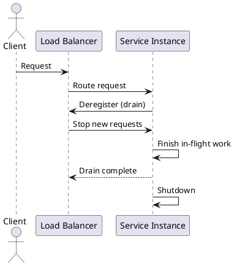

# Graceful Shutdown and Draining

**Outcomes**
- Explain graceful shutdown and request draining
- Recognize when to apply it
- Identify risks and tradeoffs

## Overview
Graceful shutdown ensures services stop accepting new requests while finishing in-flight work. Draining removes instances from load balancers before termination. Together, they reduce failed requests during deploys, autoscaling, or node failures.

## Why It Matters
Without a shutdown strategy, a restart or scale-in event can drop active requests, corrupt state, or leave jobs half-finished. Graceful shutdown preserves user experience, protects data integrity, and keeps background processing consistent.

## Core Concepts
- Stop accepting new traffic first
- Allow in-flight requests to complete
- Enforce a maximum drain timeout
- Deregister from the load balancer early
- Close resources in order (listeners, queues, DB connections)
- Expose health and readiness signals to coordinate shutdown

## When to Use
- During rolling deploys or autoscaling scale-in
- When running background jobs or long-lived requests
- When you rely on queues, websockets, or streaming connections

## Design Notes
- Separate readiness (can receive traffic) from liveness (is healthy)
- Emit structured logs for shutdown start and drain completion
- Prefer idempotent handlers so retries are safe after shutdown

## Diagram


## Example 1: Signal Handling (Go)
```go
// Simplified example: stop accepting new requests, wait, then exit.
server := http.Server{Addr: ":8080", Handler: mux}

go server.ListenAndServe()

quit := make(chan os.Signal, 1)
signal.Notify(quit, syscall.SIGTERM, syscall.SIGINT)
<-quit

ctx, cancel := context.WithTimeout(context.Background(), 20*time.Second)
defer cancel()
_ = server.Shutdown(ctx)
```

## Example 2: Kubernetes Draining
```yaml
spec:
  terminationGracePeriodSeconds: 30
  containers:
  - name: app
    lifecycle:
      preStop:
        exec:
          command: ["/bin/sh", "-c", "sleep 10"]
```
This gives the load balancer time to stop sending new traffic before the pod exits.

## Architectural Tradeoffs
- Reliability: graceful shutdown reduces dropped requests, but can still time out long-running work
- Latency: draining extends shutdown time, which can slow deploy rollouts
- Cost: longer termination windows can keep extra capacity online
- Scalability: safe scale-in requires coordination with autoscalers and load balancers
- Complexity: correct ordering and signal handling add implementation effort

## Common Pitfalls
- Not deregistering from the load balancer
- Too short a drain timeout
- Ignoring long-running background jobs
- Closing shared resources before requests finish
 - Conflating readiness and liveness probes

## Quick Recap
Graceful shutdown protects user traffic during deploys and scale events. Drain from the load balancer, finish in-flight requests, and exit cleanly with a time limit.
