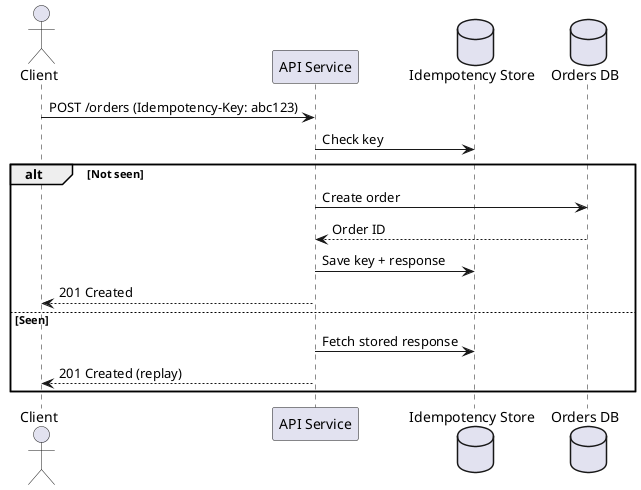

# Idempotency in Distributed Systems

**Outcomes**
- Explain idempotency and why it matters in distributed systems
- Recognize when to enforce it
- Identify risks and tradeoffs

## Overview
Idempotency means repeating the same operation produces the same result. In distributed systems, retries are common, so idempotency prevents duplicate side effects like double charges or duplicate orders. It is a core safety mechanism for APIs that must tolerate network failures and client retries.

## Why It Matters
Networks are unreliable. Clients retry when they time out, and servers may process requests twice. Idempotency makes retries safe and predictable, which is critical for payments, inventory, and order creation workflows.

## Core Concepts
- Idempotent methods: GET, PUT, DELETE (by definition)
- Non-idempotent methods: POST (unless enforced)
- Idempotency keys: client-generated tokens stored server-side
- Deduplication window: how long keys are valid
- Safe replays: return the first response for repeated keys
- State alignment: server must persist key + response before returning success

## When to Use
- Any endpoint that creates or modifies money, inventory, or user state
- Systems with retries, queues, or at-least-once delivery
- Workflows that may be executed by multiple clients or gateways

## Design Notes
- Require keys for unsafe operations and reject missing keys
- Store response bodies or references, not just a "seen" marker
- Keep idempotency storage small with TTLs and eviction policies

## Diagram


## Example 1: Client Request with Idempotency-Key
```http
POST /orders HTTP/1.1
Host: api.example.com
Idempotency-Key: 1f2c0b2a-5d2c-4b6a-9f89-7fbf2a9f4b21
Content-Type: application/json

{"sku":"A-123","qty":1}
```

## Example 2: Server-Side Dedup (Pseudo)
```python
key = request.headers.get("Idempotency-Key")
if not key:
    return error(400, "Missing Idempotency-Key")

cached = store.get(key)
if cached:
    return cached.response

result = create_order(request.body)
store.put(key, result, ttl_seconds=86400)
return result
```

## Architectural Tradeoffs
- Reliability: idempotency reduces duplicate side effects but depends on storage availability
- Latency: key checks add a database or cache hop per request
- Cost: persistent key storage increases memory or database usage
- Scalability: high write rates require efficient key indexing and TTL cleanup
- Complexity: response replay and consistency rules increase API logic

## Common Pitfalls
- Treating all POSTs as safe without a key
- Using a short TTL that expires before retries finish
- Not replaying the same response for repeated keys
- Skipping idempotency on payment or inventory APIs
 - Storing keys without persisting the original response

## Quick Recap
Idempotency makes retries safe by avoiding duplicate side effects. Use idempotency keys, store results, and replay responses for repeated requests.
