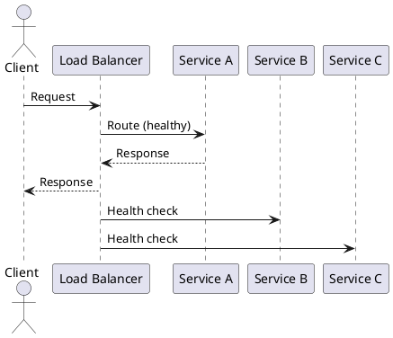

# Load Balancing Strategies

**Outcomes**
- Explain common load balancing strategies
- Recognize when to apply each strategy
- Identify risks and tradeoffs

## Overview
Load balancing distributes traffic across service instances to improve availability, latency, and throughput. Different strategies fit different workloads, and health checks keep traffic away from unhealthy instances. It is the backbone of horizontal scaling in microservices.

## Why It Matters
Uneven traffic distribution creates hot spots and failures. Load balancing improves resilience and lets you scale horizontally without changing clients. It also enables rolling deploys and failure isolation by removing unhealthy instances from rotation.

## Core Concepts
- Layer 4 vs Layer 7 load balancers
- Algorithms: round robin, least connections, least latency, weighted, hash-based
- Health checks: remove unhealthy instances quickly
- Connection draining: let in-flight requests finish
- Sticky sessions: optional affinity for stateful workloads
- Observability: request distribution and error-rate metrics

## When to Use
- Any service with multiple instances or replicas
- Systems with variable traffic spikes or seasonal load
- Deployments that require zero-downtime rollouts

## Design Notes
- Prefer stateless services to avoid sticky sessions
- Use health checks tuned to the failure modes of your services
- Match the algorithm to traffic patterns (latency-sensitive vs throughput)

## Diagram


## Example 1: Nginx Round Robin with Weights
```nginx
upstream api_pool {
    server 10.0.0.10 weight=3;
    server 10.0.0.11 weight=2;
    server 10.0.0.12 weight=1;
}

server {
    location / {
        proxy_pass http://api_pool;
    }
}
```

## Example 2: Client-Side Round Robin (Pseudo)
```python
servers = ["http://a", "http://b", "http://c"]
idx = 0

def next_server():
    global idx
    server = servers[idx % len(servers)]
    idx += 1
    return server

# Use next_server() when sending each request.
```

## Architectural Tradeoffs
- Scalability: enables horizontal scale, but adds another hop in the request path
- Reliability: health checks and failover improve uptime, but misconfigured checks can cause outages
- Latency: Layer 7 routing adds processing overhead but enables smarter routing
- Cost: managed load balancers add recurring cost; self-managed adds ops overhead
- Complexity: multiple algorithms and routing rules increase configuration risk

## Common Pitfalls
- Ignoring health checks or using slow intervals
- Sticky sessions without a real need
- Using one algorithm for all traffic types
- Skipping connection draining during deploys
 - Overloading one region or zone due to uneven weights

## Quick Recap
Load balancers spread traffic to keep services responsive. Choose algorithms that fit your traffic, use health checks, and drain connections before shutdown.
