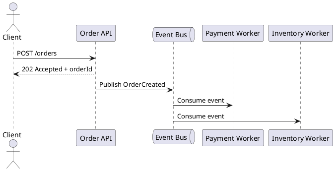

# Async Patterns Overview

Video: https://youtu.be/yTbAFsfLgyQ

**Outcomes**
- Compare common asynchronous interaction patterns
- Choose async patterns for appropriate business workflows
- Account for reliability and observability implications

## Overview
Asynchronous patterns decouple request initiation from completion. Instead of forcing callers to wait for end-to-end work, systems acknowledge quickly and complete processing in the background. This improves concurrency and reduces coupling, especially for workflows that involve multiple services or variable latency.

## Why It Matters
Synchronous chains are fragile under load and slow dependencies. Async patterns help absorb spikes, smooth throughput, and improve availability. They also shift complexity into delivery guarantees, retries, ordering, and tracing.

## Core Patterns
- Fire-and-forget event publication
- Request-acknowledge with later status lookup
- Asynchronous request-reply via callback/webhook/topic
- Queue-based worker processing
- Orchestrated workflow with explicit state transitions

## Design Guidelines
- Use correlation IDs across all messages
- Make handlers idempotent to tolerate retries
- Define retry policy and dead-letter handling explicitly
- Use durable messaging for critical workflows
- Document eventual consistency expectations for clients

## Example Workflow
Order placement:
- Client submits order and receives `202 Accepted` with `orderId`.
- Order service publishes `OrderCreated`.
- Payment and inventory process independently.
- Final status is published as `OrderConfirmed` or `OrderFailed`.

## Diagram

## Architectural Tradeoffs
- Scalability: decouples producers and consumers, better burst tolerance
- Latency: better perceived response time, but eventual completion
- Complexity: harder debugging due to distributed control flow
- Consistency: usually eventual, not immediate

## Common Pitfalls
- No idempotency keys or duplicate protection
- Missing poison-message/dead-letter strategy
- Treating message delivery as guaranteed processing
- Forgetting to expose status endpoints to clients

## Quick Recap
Async patterns increase resilience and throughput by decoupling timing. They require disciplined handling of retries, state, and observability to remain predictable.