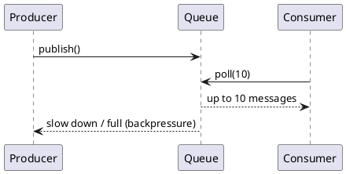
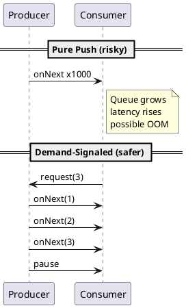

# Backpressure Push vs Pull

Video: https://youtu.be/FpIvK3Mm-MU

**Outcomes**
- Define backpressure and why it is required
- Distinguish push and pull flow-control models
- Select practical overload policies by domain criticality
- Decide when to use push, pull, or hybrid demand-signaled flow

## Overview
Backpressure is the mechanism that prevents fast producers from overwhelming slower consumers. In distributed systems, mismatched processing speed is normal. Backpressure makes this mismatch explicit and controlled instead of allowing queue growth to hide the problem.

## Why It Matters
Without backpressure, systems often fail gradually: latency rises, queues grow, memory pressure increases, and then failures cascade. Backpressure keeps systems within safe operating limits and preserves service quality under surge traffic.

## Core Intuition
- Producer speed and consumer speed are rarely equal
- Buffers absorb short spikes, not sustained mismatch
- Backpressure is how consumers communicate capacity
- Good systems fail *predictably* under overload, not randomly

## Push vs Pull
- Push model: producer emits when ready; consumer risks overload unless producer slows down
- Pull model: consumer requests work when ready; natural load regulation
- Hybrid demand-signaled push: producer pushes only what consumer has requested

## Push Model (When It Works)
Use push when:
- Event timeliness matters (alerts, chat, market updates)
- Consumers can scale horizontally quickly
- Short bursts are expected and absorbable

Risks:
- Consumer lag can grow unnoticed
- Queue/buffer growth can hide instability
- Requires strong rate limits and bounded buffers

## Pull Model (When It Works)
Use pull when:
- Consumers process expensive or variable-duration work
- You need strict control over concurrency
- Work can tolerate polling/lease latency

Benefits:
- Natural pacing from consumer demand
- Easier to isolate slow consumers
- Clear capacity planning via workers and poll size

## Hybrid Demand-Signaled Push
This is the reactive-streams style model:
- Consumer sends demand (`request(n)`)
- Producer emits up to `n`
- Consumer requests more when ready

This combines push efficiency with pull safety.

## Backpressure Strategies
- Bounded queue with reject/drop policy
- Rate limiting or token bucket controls
- Batch sizing and controlled concurrency
- Sampling/dropping non-critical events
- Dead-letter queues for unprocessable messages

## Concrete Examples
### Example 1: API Gateway Protecting a Dependency
- Inbound requests spike to 5,000 RPS
- Downstream service can handle 1,500 RPS
- Gateway applies token bucket (1,500 RPS + burst), returns `429` above limit
- Result: predictable shedding instead of timeout cascade

### Example 2: Queue Worker Pulling in Batches
- Worker polls `10` messages, processes, then polls again
- Slow DB day? Reduce batch to `5` and consumer concurrency to `N`
- Result: throughput drops, but system remains stable

### Example 3: Reactive Stream Demand
- Subscriber requests `32` items
- Publisher sends exactly `32`, then pauses
- Subscriber requests next `32` after processing
- Result: bounded memory and smoother latency

## Policy by Business Semantics
- Never drop: payments, orders, financial transactions
- May drop/sample: debug logs, metrics at high cardinality, telemetry bursts
- Delay and retry: notifications or non-critical enrichment

## Diagram: Pull With Backpressure


## Diagram: Push Overload vs Demand-Signaled Flow


## Minimal Implementation Patterns
### Pattern A: Bounded Queue + Reject
```text
if queue.size >= MAX:
  reject_or_drop(message)
else:
  queue.push(message)
```

### Pattern B: Consumer Pull Loop
```text
while running:
  batch = queue.poll(max_items=20, timeout=100ms)
  process_with_concurrency_limit(batch, limit=8)
```

### Pattern C: Demand Signal
```text
onSubscribe(sub):
  sub.request(50)

onNext(item):
  process(item)
  sub.request(1)
```

## When to Use What
- Choose **push** for low-latency fan-out where occasional drop is acceptable
- Choose **pull** for durable jobs and controlled worker throughput
- Choose **hybrid demand-signaled** for high-concurrency streams with strict stability goals

## Decision Checklist
1. Is data loss acceptable for this event type?
2. Do consumers have highly variable processing time?
3. Is low-latency delivery more important than strict durability?
4. Can we observe queue depth, lag, reject rate, and retry volume?
5. Do we have explicit overflow behavior (`drop`, `retry`, `dead-letter`, `429`)?

## Architectural Tradeoffs
- Stability: strong gain from bounded load behavior
- Throughput: may reduce peak throughput to maintain reliability
- Freshness: buffering/retries can increase end-to-end latency
- Complexity: requires explicit rejection, retry, and observability paths

## Common Pitfalls
- Using unbounded queues "for safety"
- Applying one policy to all event types
- Dropping critical messages without auditability
- Ignoring queue depth and consumer lag metrics
- Retrying too aggressively during active overload

## Quick Recap
Backpressure is a contract that protects system stability. Choose push, pull, or hybrid flow control based on workload shape and business-critical data guarantees.
