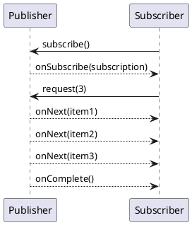

# Reactive Streams Concepts

Video: https://youtu.be/LQ_fEMRrMxA

**Outcomes**
- Explain the reactive streams model and key signals
- Understand demand-driven flow control
- Evaluate when stream-based pipelines are a good fit
- Decide when reactive streams are the wrong tool

## Overview
Reactive streams model data as asynchronous sequences with explicit demand signaling between consumer and producer. The goal is stable, non-blocking processing with bounded resources, even when producers and consumers run at different speeds.

## Why It Matters
Without flow control, push-based systems can overwhelm downstream services. Reactive streams standardize how producers emit data and how consumers request it, reducing overload risk and enabling safer high-concurrency pipelines.

## Why Teams Use Reactive Streams
- **Backpressure by contract**: consumers request data (`request(n)`), so producers do not flood them
- **High concurrency with fewer threads**: useful for I/O-heavy paths with variable latency
- **Composability**: operators (`map`, `flatMap`, `buffer`, `window`) help build pipelines in stages
- **Consistent lifecycle**: clear terminal signals (`onComplete`, `onError`) simplify control flow
- **Resilience support**: easier integration with timeout, retry, bulkhead, and circuit breaker policies

## Core Concepts
- Publisher: source of stream elements
- Subscriber: consumer of stream elements
- Subscription: contract that includes request(n)
- Signals: onSubscribe, onNext, onError, onComplete
- Operators: map, filter, flatMap, reduce

## Stream Lifecycle
1. Subscriber subscribes to publisher.
2. Publisher sends `onSubscribe` with a subscription.
3. Subscriber requests `n` items.
4. Publisher emits up to `n` `onNext` items.
5. Stream ends with `onComplete` or `onError`.

## How Backpressure Prevents Overload
When a consumer is slow, it simply requests fewer items. A compliant publisher must stop after producing the requested count. This protects memory and avoids queue explosions.

Example:
- Consumer requests `10`
- Producer emits exactly `10` items
- Producer pauses until the next `request(n)`

## Practical Uses
- Streaming APIs and incremental responses (SSE, WebFlux, gRPC streams)
- Event processing pipelines with transformation stages
- I/O-heavy integrations where blocking threads are expensive
- Multi-step enrichment flows (call service A, B, C without blocking threads)
- Telemetry/metrics ingestion with bounded processing

## Diagram


## Example: Java (Flow API)
```java
SubmissionPublisher<Integer> publisher = new SubmissionPublisher<>();

publisher.subscribe(new Flow.Subscriber<>() {
  private Flow.Subscription subscription;

  public void onSubscribe(Flow.Subscription s) {
    subscription = s;
    subscription.request(2);  // initial demand
  }

  public void onNext(Integer item) {
    System.out.println("item = " + item);
    subscription.request(1);  // incremental demand
  }

  public void onError(Throwable t) { t.printStackTrace(); }
  public void onComplete() { System.out.println("done"); }
});

publisher.submit(100);
publisher.submit(200);
publisher.close();
```

## Example: Node.js (RxJS)
```javascript
const { from, of } = require("rxjs");
const { filter, map, mergeMap, catchError } = require("rxjs/operators");

from([1, 2, 3, 4, 5]).pipe(
  filter((x) => x % 2 === 1),
  map((x) => x * 10),
  mergeMap((x) => of({ value: x, status: "ok" })),
  catchError((err) => of({ status: "error", message: err.message }))
).subscribe({
  next: console.log,
  error: console.error,
  complete: () => console.log("complete")
});
```

## Example: Streaming Endpoint (When to Use)
Use reactive streams when clients can consume partial results over time:
- live notifications
- progress updates for long-running jobs
- large result sets delivered incrementally

Avoid for:
- simple CRUD endpoint with one quick DB call
- very small systems where synchronous style is clearer

## When to Use Reactive Streams
Use reactive streams when most of these are true:
- Workload is I/O-bound with unpredictable latency
- Throughput and concurrency are more important than per-request simplicity
- You need bounded resource usage under burst traffic
- You can invest in reactive observability and team training
- You need stream semantics (events over time), not just request/response

## When NOT to Use Reactive Streams
- Simple CRUD service with low concurrency
- CPU-bound workloads (reactive does not make CPU-heavy logic faster)
- Team lacks reactive debugging/tooling experience
- You cannot avoid blocking calls in critical sections
- You need the simplest possible codepath for maintainability

## Decision Checklist
Choose reactive streams if your answer is **yes** to at least 3:
1. Do we have bursty traffic or high concurrency needs?
2. Are downstream dependencies often slow/variable?
3. Do we need demand-aware flow control to avoid overload?
4. Are we prepared to run end-to-end non-blocking infrastructure?
5. Do we need continuous/event-driven outputs instead of one response?

## Architectural Tradeoffs
- Throughput: excellent for many concurrent I/O operations
- Resource safety: bounded demand helps avoid overload
- Complexity: debugging operator chains can be difficult
- Team fit: requires consistent reactive mental model and tooling

## Common Pitfalls
- Mixing blocking calls inside reactive pipelines
- Unlimited buffering between operators
- Ignoring cancellation and timeout behavior
- Overusing reactive style for simple CRUD paths

## Quick Recap
Reactive streams are not just async; they add demand-aware contracts that keep producers and consumers in balance under load.
