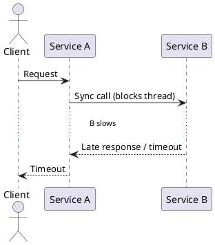

# Why Blocking Systems Fail

**Outcomes**
- Explain why blocking I/O creates scalability limits
- Predict failure behavior under latency spikes
- Identify practical mitigation strategies

## Overview
Blocking systems dedicate a thread (or worker) to each request until all downstream work completes. This is simple to reason about, but it couples throughput to thread count and dependency latency. As latency grows, active threads are consumed by waiting, queues build, and user-facing timeouts increase.

## Why It Matters
Most microservice incidents are not hard crashes first; they start as slow dependencies. In blocking designs, slow calls occupy scarce workers, starving new requests. The result is a cascading failure pattern: increased latency, retries, queue growth, and finally saturation.

## Core Concepts
- Thread-per-request model and worker pool limits
- Queueing effects and tail latency amplification
- Context switching and memory overhead of large thread pools
- Retry storms caused by synchronous timeout chains
- Capacity math intuition (arrival rate vs service time)

## Failure Scenario
- Service A has 200 request threads.
- A depends synchronously on Service B.
- B latency rises from 40 ms to 2 s.
- A's threads block waiting on B, queue depth rises, and A starts timing out healthy requests.

## Mitigation Patterns
- Use strict timeouts and bounded retries with jitter
- Break synchronous chains with asynchronous queues/events
- Add circuit breakers and bulkheads around slow dependencies
- Prefer backpressure over unbounded request queues

## Diagram

## Architectural Tradeoffs
- Simplicity: blocking code is easy to debug and reason about
- Performance: good for low concurrency and short, predictable calls
- Resilience risk: poor behavior under dependency slowdown
- Cost: scaling blocking workloads often means overprovisioning workers

## Common Pitfalls
- Assuming more threads always solves latency problems
- Using long default HTTP client timeouts
- Allowing unbounded server queues
- Retrying synchronously at every layer

## Quick Recap
Blocking systems fail by saturation, not only by crashes. The key is to reduce waiting, bound resource usage, and isolate slow dependencies before they cause system-wide timeouts.