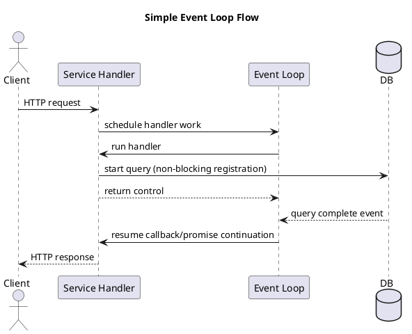
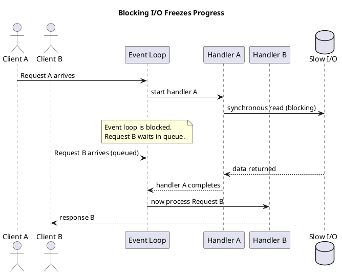
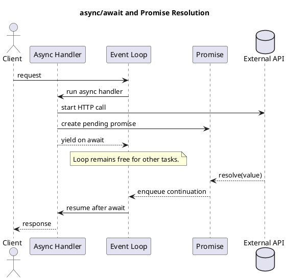
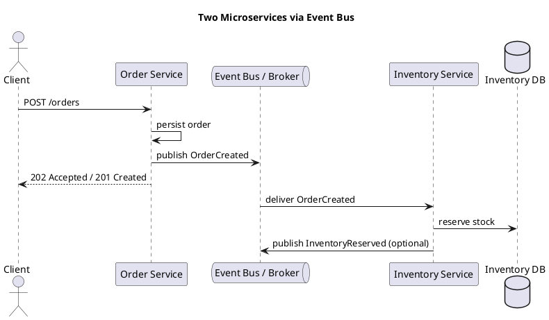
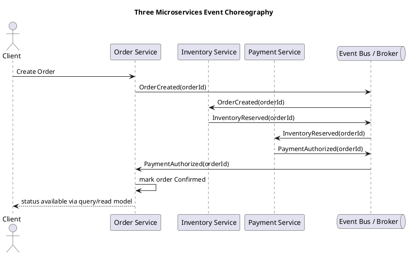
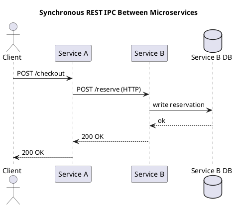
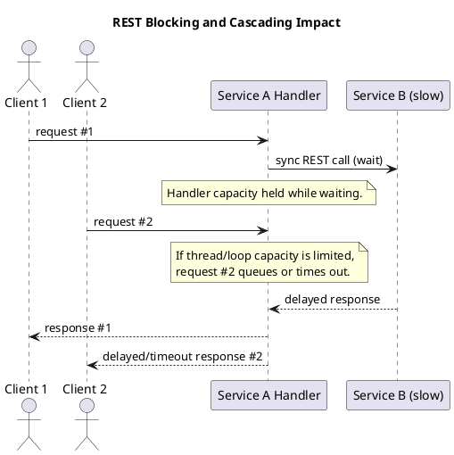
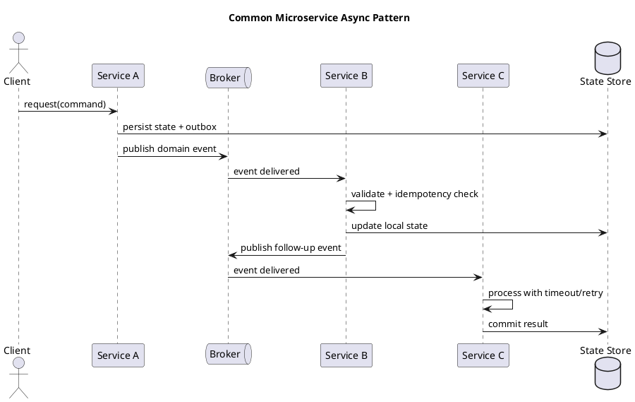

# Event Loop and Inter-Process Communication in Microservices

Video: https://youtu.be/_68lb9BznDY


**Purpose:** Explain how the microservice event loop works, why blocking I/O hurts throughput, and how services communicate using event-driven architecture with 2-service and 3-service scenarios.

**Outcomes**
- Explain the event loop execution model in a microservice
- Describe what happens when synchronous I/O blocks the loop
- Show how `Promise`, `async`, and `await` change request flow
- Explain event-driven communication between 2 and 3 microservices

## 1) Event Loop Fundamentals

In event-loop-based services (for example Node.js services), the runtime runs application logic on a single main thread.  
I/O operations (database queries, HTTP calls, file reads) are delegated to the OS/runtime, and completion callbacks are placed back onto queues that the loop processes.

Think of the event loop as a dispatcher:
- Take next task from queue
- Execute JavaScript handler
- If handler starts I/O, register callback and move on
- When I/O completes, enqueue continuation
- Repeat

### Diagram: Simple Event Loop Flow


## 2) What Blocking I/O Looks Like

If the handler performs blocking/synchronous I/O, the event loop cannot process other queued work until that operation finishes.

This causes:
- Increased tail latency
- Queue buildup
- Throughput collapse under burst traffic

### Diagram: Event Loop Blocked by Synchronous I/O


## 3) Promises, Async, and Await

### Promise concept
A `Promise` represents a future result:
- `pending`: work started, no result yet
- `fulfilled`: success result available
- `rejected`: error result available

Promises let code register continuation behavior (`then`, `catch`, `finally`) without blocking the event loop.

### Async/Await concept
- `async` marks a function that returns a Promise
- `await` pauses that function logically, but does **not** block the entire event loop
- While waiting, the loop can execute other requests

### Diagram: Async/Await with Non-Blocking Continuation


## 4) Two Microservices with Event-Driven Communication

Scenario:
- `Order Service` accepts a new order
- It publishes `OrderCreated`
- `Inventory Service` subscribes and reserves stock

This is asynchronous inter-process communication through a broker (Kafka, RabbitMQ, SNS/SQS, etc.).

### Why this helps
- Producer and consumer are decoupled in time
- Independent scaling per service
- Better resilience when one service is temporarily slow

### Diagram: 2-Service Event-Driven Flow


## 5) Three Microservices with Event-Driven Communication

Scenario:
- `Order Service` publishes `OrderCreated`
- `Inventory Service` consumes and publishes `InventoryReserved`
- `Payment Service` consumes reservation event and publishes `PaymentAuthorized`
- Optionally, `Order Service` consumes final event to mark order confirmed

This creates a choreography flow: each service reacts to domain events.

### Architectural implications
- No direct synchronous dependency between all services
- Eventual consistency instead of immediate consistency
- Requires idempotent consumers and correlation IDs

### Diagram: 3-Service Choreography


## 6) Another IPC Method: Synchronous REST Between Services

Message queues are not the only IPC option. A common alternative is direct HTTP/REST calls:
- Service A receives request
- Service A calls Service B synchronously
- Service A waits for Service B response before continuing

This is simple to understand, but introduces temporal coupling.

### Diagram: REST IPC (Synchronous Request/Response)


### Blocking Problems with REST IPC

When Service A blocks waiting on Service B:
- Request threads/event-loop capacity are occupied
- Slow/down Service B propagates latency to Service A
- Retries can amplify load and trigger cascading failures
- Availability of A becomes coupled to B

### Diagram: Blocking and Cascading Delay in REST Chain


### REST IPC vs Event-Driven IPC

| Method | Strength | Main Risk | Mitigation |
|---|---|---|---|
| Synchronous REST | Immediate response, simple request/response semantics | Blocking, tight runtime coupling | Timeouts, circuit breakers, bulkheads, fallbacks |
| Event-driven (broker) | Temporal decoupling, resilient async workflows | Eventual consistency, duplicate delivery | Idempotency, DLQ, correlation IDs, retries |

## 7) Language Differences: Event Loop and Concurrency Models

The event-loop idea exists across ecosystems, but implementation differs by runtime/framework.

| Language | Typical Model | Single-Threaded Event Loop? | Multi-Threaded? | Notes |
|---|---|---|---|---|
| Node.js | Event loop + async I/O | Yes (JS execution thread) | Optional worker threads | Great for I/O-heavy APIs; avoid CPU blocking in handlers |
| Python | `asyncio`/ASGI or thread/process workers | Yes (when using `asyncio`) | Yes | FastAPI async is event-loop based; sync frameworks often use threads |
| Java | Reactive (Netty/WebFlux) or thread-per-request | Yes (in reactive stacks) | Yes | Spring MVC commonly thread-per-request; WebFlux is event-loop/reactive |
| Go | Goroutines + runtime scheduler + netpoll | Not JS-style single loop | Yes (M:N scheduling) | Concurrency is cheap and scheduler-driven; channels/context are key |
| Rust | Async runtime (`tokio`) or blocking threads | Yes (runtime-driven tasks) | Yes | `async/.await` with executors; blocking tasks should be offloaded |

### Diagram: Single-Thread Event Loop vs Multi-Thread Request Handling
```plantuml
@startuml
title Single-Thread Event Loop vs Multi-Thread Model

rectangle "Single-Thread Event Loop Model" as S {
  queue "Task Queue" as SQ
  participant "Event Loop Thread" as ELT
  database "Async I/O (OS/Runtime)" as SIO
  SQ -> ELT: next task
  ELT -> SIO: start I/O
  SIO --> SQ: completion callback/task
}

rectangle "Multi-Thread Request Model" as M {
  participant "Worker Thread 1" as T1
  participant "Worker Thread 2" as T2
  participant "Worker Thread N" as TN
  database "Blocking/Non-Blocking I/O" as MIO
  T1 -> MIO: request A work
  T2 -> MIO: request B work
  TN -> MIO: request N work
}
@enduml
```

### Diagram: Go Scheduler vs Classic Event Loop (Conceptual)
```plantuml
@startuml
title Go Scheduler (M:N) vs Classic Event Loop
rectangle "Classic Event Loop" as CEL {
  participant "1 Loop Thread" as L1
  queue "Callback Queue" as CQ
  L1 -> CQ: dequeue + execute
}

rectangle "Go Runtime Scheduler" as GO {
  collections "Goroutines (G)" as G
  participant "Logical Processors (P)" as P
  participant "OS Threads (M)" as M
  G --> P: runnable goroutines
  P --> M: schedule execution
}
@enduml
```

## 8) Common Patterns Across All Languages

Even with different runtimes, production microservices converge on the same patterns:
- Non-blocking or bounded blocking for I/O-heavy paths
- Timeout + retry + backoff policies for dependency calls
- Concurrency limits (worker pools, semaphores, bounded queues)
- Cancellation propagation (`context`, cancellation token, reactive cancel)
- Idempotent event consumers and deduplication
- Correlation IDs and distributed tracing for async flows

### Diagram: Common Event-Driven Pattern (Language-Agnostic)


## 9) Comparing the Scenarios

| Scenario | Main Benefit | Main Risk | Key Control |
|---|---|---|---|
| Single service event loop | High I/O concurrency with low thread overhead | Blocking call freezes throughput | Keep handlers non-blocking |
| 2 services via events | Decoupled producer/consumer | Duplicate or delayed events | Idempotency + retries |
| 3 services via events | Scalable business workflow composition | Eventual consistency complexity | Correlation IDs + observability |

## 10) Practical Guidance

- Avoid blocking libraries inside event-loop handlers
- Add timeouts and circuit breakers on outbound I/O
- Use bounded concurrency to protect downstream dependencies
- Treat every consumer as at-least-once (handle duplicates safely)
- Track `eventId`, `correlationId`, and causal order in logs/traces

## 11) Code Examples by Scenario

### 11.1 Simple Event Loop (Non-Blocking I/O)
```javascript
import express from 'express';
import fetch from 'node-fetch';

const app = express();

app.get('/profile/:id', async (req, res) => {
  const id = req.params.id;
  const data = await fetch(`http://user-service/users/${id}`).then(r => r.json());
  res.json(data);
});
```

### 11.2 Blocking I/O in Event Loop (What Not to Do)
```javascript
import fs from 'fs';

app.get('/report', (req, res) => {
  // Blocks the event loop until disk read finishes.
  const file = fs.readFileSync('./large-report.json', 'utf8');
  res.type('application/json').send(file);
});
```

### 11.3 Promise + Async/Await
```javascript
app.get('/dashboard/:id', async (req, res) => {
  const id = req.params.id;

  const userPromise = userClient.getUser(id);      // Promise<User>
  const ordersPromise = orderClient.getOrders(id); // Promise<Order[]>

  const [user, orders] = await Promise.all([userPromise, ordersPromise]);
  res.json({ user, orders });
});
```

### 11.4 Two Services with Event-Driven IPC
```javascript
// Order Service (producer)
app.post('/orders', async (req, res) => {
  const order = await orderRepo.save(req.body);
  await broker.publish('orders.events', {
    type: 'OrderCreated',
    eventId: crypto.randomUUID(),
    orderId: order.id
  });
  res.status(202).json({ orderId: order.id });
});

// Inventory Service (consumer)
broker.subscribe('orders.events', async (event) => {
  if (event.type !== 'OrderCreated') return;
  await inventory.reserve(event.orderId);
});
```

### 11.5 Three Services Event Choreography
```javascript
// Inventory Service
broker.subscribe('orders.events', async (event) => {
  if (event.type !== 'OrderCreated') return;
  await inventory.reserve(event.orderId);
  await broker.publish('inventory.events', {
    type: 'InventoryReserved',
    orderId: event.orderId
  });
});

// Payment Service
broker.subscribe('inventory.events', async (event) => {
  if (event.type !== 'InventoryReserved') return;
  await payments.authorize(event.orderId);
  await broker.publish('payments.events', {
    type: 'PaymentAuthorized',
    orderId: event.orderId
  });
});

// Order Service
broker.subscribe('payments.events', async (event) => {
  if (event.type !== 'PaymentAuthorized') return;
  await orderRepo.markConfirmed(event.orderId);
});
```

### 11.6 Synchronous REST IPC + Blocking Risk Controls
```javascript
import axios from 'axios';

app.post('/checkout', async (req, res) => {
  try {
    // Synchronous dependency call from Service A to Service B.
    const r = await axios.post(
      'http://inventory-service/reserve',
      { orderId: req.body.orderId },
      { timeout: 300 } // critical to avoid long blocking wait
    );
    res.json({ status: 'ok', reservation: r.data });
  } catch (err) {
    // fallback / graceful degradation
    res.status(503).json({ status: 'degraded', reason: 'inventory_unavailable' });
  }
});
```

## Quick Recap

The event loop is efficient when work is non-blocking.  
Blocking I/O stalls all queued work on that loop.  
`Promise`, `async`, and `await` keep logic readable while preserving non-blocking behavior.  
Event-driven communication lets 2 or 3 microservices coordinate asynchronously with better decoupling and scalability, at the cost of eventual consistency and stronger observability requirements.
