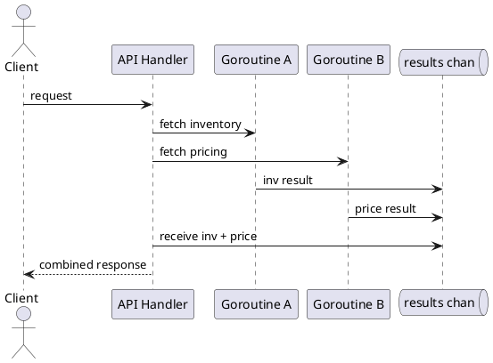

# Go Concurrency Overview

Video: https://youtu.be/HoI7LGD7kaM

**Length:** 10-15 minutes

**Purpose:** Show how Go's concurrency model supports scalable, I/O-heavy services with predictable behavior under load.

**Outcomes**
- Explain goroutines, channels, and worker pools at an architectural level
- Recognize when Go concurrency improves throughput and latency
- Identify coordination and cancellation risks in production services

## Overview
Go uses lightweight goroutines and channels to structure concurrent work. Instead of manually managing many OS threads, applications can run many tasks concurrently and coordinate through message passing.

One practical way to think about this in a service is: every incoming request can start small units of work that mostly wait on I/O. While one goroutine is blocked on a database query or an HTTP call, the runtime can schedule other goroutines on the same worker threads. That makes Go especially effective for API gateways, aggregators, and queue consumers.

## Why It Matters
Microservices often spend time waiting on network or disk I/O. Concurrency lets the service continue useful work while waiting, improving utilization and reducing request queuing.

## Core Concepts
- Goroutine: lightweight concurrent function
- Channel: typed communication pipe between goroutines
- `select`: waits on multiple channel operations
- `context.Context`: cancellation and deadlines across call chains
- Worker pool: bounded concurrency pattern for stable throughput

### How These Pieces Fit Together
- Goroutines give you concurrency, but not coordination by themselves.
- Channels provide a safe handoff point so goroutines can exchange results without shared mutable state.
- `select` is the control point that lets a goroutine react to whichever event happens first: a result arrives, a timeout fires, or a parent context is cancelled.
- `context.Context` is what makes request-scoped concurrency production-safe. If the client disconnects or a deadline is exceeded, all spawned work should stop.

## Example: Fan-Out/Fan-In with Channels
```go
results := make(chan string, 2)

go func() { results <- callInventory() }()
go func() { results <- callPricing() }()

inv := <-results
price := <-results
response := combine(inv, price)
```

This pattern reduces end-to-end latency when the downstream calls are independent. If `callInventory()` and `callPricing()` each take 80 ms, sequential execution is roughly 160 ms, while concurrent execution is closer to the slower of the two calls plus merge overhead.

In real code, you usually want to tag results so you know which response came back:

```go
type result struct {
  source string
  value  string
  err    error
}

results := make(chan result, 2)

go func() { results <- result{source: "inventory", value: callInventory()} }()
go func() { results <- result{source: "pricing", value: callPricing()} }()
```

## Example: Bounded Worker Pool
```go
jobs := make(chan Job, 100)
for i := 0; i < 8; i++ {
  go worker(jobs)
}

for _, job := range incoming {
  jobs <- job
}
close(jobs)
```

The important idea is not the loop itself, but the bound. With 8 workers, the service will process at most 8 jobs actively at a time. Under load, new jobs queue instead of spawning unlimited goroutines and exhausting memory or downstream connection pools.

That makes worker pools a common fit for:
- background email sending
- event consumers
- batch writes to storage
- request fan-out with a hard upper concurrency limit

## Example: `select` for Timeout or Cancellation
```go
select {
case msg := <-results:
  return msg, nil
case <-time.After(200 * time.Millisecond):
  return "", errors.New("downstream timeout")
case <-ctx.Done():
  return "", ctx.Err()
}
```

This is the missing piece in many early Go examples. Concurrency is only useful if it can also stop cleanly. In services, `select` is often where you prevent stuck handlers, leaked goroutines, and orphaned downstream calls.

## Example: Context-Aware Worker
```go
func worker(ctx context.Context, jobs <-chan Job) {
  for {
    select {
    case <-ctx.Done():
      return
    case job, ok := <-jobs:
      if !ok {
        return
      }
      process(job)
    }
  }
}
```

This pattern matters when a service is shutting down or when a request-scoped worker tree should be cancelled. Without it, workers may continue processing even though the caller no longer cares about the result.

## Diagram


## When to Use
- I/O-heavy services with independent downstream calls
- Background processing with bounded parallelism
- Services that need cancellation-aware request handling

## When Not to Use
- Simple linear logic where concurrency adds no value
- CPU-bound workloads where algorithmic optimization matters more
- Flows where shared mutable state is unavoidable and risky

## Architectural Tradeoffs
- Throughput: often improves under concurrent I/O
- Complexity: race conditions and deadlocks are possible
- Reliability: cancellation improves safety when done correctly
- Operations: requires metrics for goroutine count, queue depth, and latency

## Common Pitfalls
- Unbounded goroutine creation under traffic spikes
- Ignoring context cancellation in downstream calls
- Blocking on channels without timeout paths
- Sharing mutable state without synchronization
- Assuming concurrency always means faster; some work is simpler and safer when done sequentially
- Forgetting to drain or close channels, leaving goroutines blocked forever

## Quick Recap
Go concurrency is a practical way to improve I/O throughput while keeping control explicit through channels, worker limits, and cancellation.
