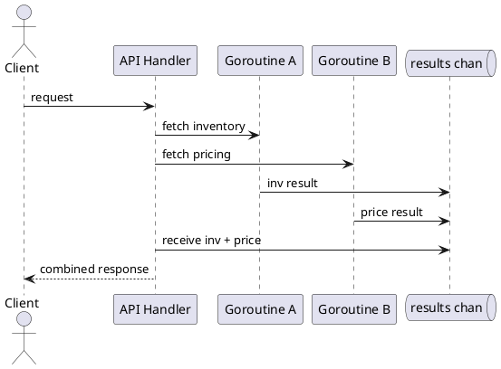

# Go Concurrency Overview

**Length:** 10-15 minutes

**Purpose:** Show how Go's concurrency model supports scalable, I/O-heavy services with predictable behavior under load.

**Outcomes**
- Explain goroutines, channels, and worker pools at an architectural level
- Recognize when Go concurrency improves throughput and latency
- Identify coordination and cancellation risks in production services

## Overview
Go uses lightweight goroutines and channels to structure concurrent work. Instead of manually managing many OS threads, applications can run many tasks concurrently and coordinate through message passing.

## Why It Matters
Microservices often spend time waiting on network or disk I/O. Concurrency lets the service continue useful work while waiting, improving utilization and reducing request queuing.

## Core Concepts
- Goroutine: lightweight concurrent function
- Channel: typed communication pipe between goroutines
- `select`: waits on multiple channel operations
- `context.Context`: cancellation and deadlines across call chains
- Worker pool: bounded concurrency pattern for stable throughput

## Example: Fan-Out/Fan-In with Channels
```go
results := make(chan string, 2)

go func() { results <- callInventory() }()
go func() { results <- callPricing() }()

inv := <-results
price := <-results
response := combine(inv, price)
```

## Example: Bounded Worker Pool
```go
jobs := make(chan Job, 100)
for i := 0; i < 8; i++ {
  go worker(jobs)
}

for _, job := range incoming {
  jobs <- job
}
close(jobs)
```

## Diagram


## When to Use
- I/O-heavy services with independent downstream calls
- Background processing with bounded parallelism
- Services that need cancellation-aware request handling

## When Not to Use
- Simple linear logic where concurrency adds no value
- CPU-bound workloads where algorithmic optimization matters more
- Flows where shared mutable state is unavoidable and risky

## Architectural Tradeoffs
- Throughput: often improves under concurrent I/O
- Complexity: race conditions and deadlocks are possible
- Reliability: cancellation improves safety when done correctly
- Operations: requires metrics for goroutine count, queue depth, and latency

## Common Pitfalls
- Unbounded goroutine creation under traffic spikes
- Ignoring context cancellation in downstream calls
- Blocking on channels without timeout paths
- Sharing mutable state without synchronization

## Quick Recap
Go concurrency is a practical way to improve I/O throughput while keeping control explicit through channels, worker limits, and cancellation.
