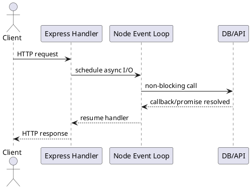

# Node Express Async Overview

**Length:** 10-15 minutes

**Purpose:** Explain non-blocking I/O in Node.js and how async patterns improve API throughput.

**Outcomes**
- Explain event loop behavior at an architectural level
- Recognize when async handlers improve responsiveness
- Identify blocking risks and mitigation patterns

## Overview
Node.js uses a single-threaded event loop for JavaScript execution and delegates I/O work to the runtime. This model handles many concurrent connections efficiently when handlers stay non-blocking.

## Why It Matters
Blocking one request handler can block progress for many others. Correct async patterns keep the event loop available for new work and reduce tail latency under load.

## Core Concepts
- Event loop: schedules callback and promise continuations
- Non-blocking I/O: network and file operations complete asynchronously
- `async/await`: readable asynchronous control flow
- Backpressure-aware streaming: avoid buffering entire payloads in memory
- Concurrency limits: prevent overload to downstream dependencies

## Example: Parallel Dependency Calls
```javascript
app.get('/profile/:id', async (req, res) => {
  const id = req.params.id;
  const [user, orders] = await Promise.all([
    userClient.get(id),
    orderClient.listByUser(id)
  ]);
  res.json({ user, orders });
});
```

## Example: Stream Response Safely
```javascript
app.get('/export', async (req, res) => {
  res.setHeader('Content-Type', 'application/json');
  const stream = createExportStream();
  stream.pipe(res);
});
```

## Diagram


## When to Use
- I/O-bound APIs with many concurrent clients
- Gateway or aggregation services
- Streaming endpoints and event-driven APIs

## When Not to Use
- CPU-heavy workloads without worker threads
- Long synchronous loops inside request handlers
- Workloads that require strict per-request isolation via processes

## Architectural Tradeoffs
- Throughput: high for I/O-heavy traffic
- Simplicity: async chains can become complex
- Reliability: easier overload if concurrency is unbounded
- Operations: event loop lag is a critical metric

## Common Pitfalls
- Blocking the event loop with CPU-heavy code
- Missing timeout and cancellation handling
- Unbounded `Promise.all` fan-out to dependencies
- Ignoring stream backpressure and memory growth

## Quick Recap
Node async patterns are effective for high-concurrency I/O services when handlers stay non-blocking and downstream pressure is controlled.
