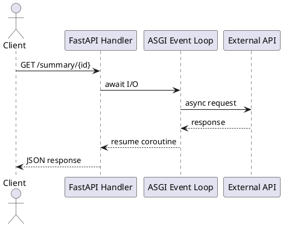

# Python FastAPI Async Overview

Video: https://youtu.be/3wA9rvkYftc

**Purpose:** Introduce async request handling in FastAPI and when it improves service scalability.

**Outcomes**
- Explain async endpoint behavior and event loop execution
- Identify workloads that benefit from `async def`
- Recognize blocking hazards in Python web services

## Overview
FastAPI supports asynchronous endpoints using `async def`. With an ASGI server, requests can make progress concurrently while waiting on I/O operations.

## Why It Matters
If handlers spend most time waiting on network calls, async endpoints improve concurrency without allocating one thread per waiting request.

## Core Concepts
- `async def` endpoint: coroutine-based request handler
- `await`: yields control while waiting on I/O
- ASGI server (e.g., Uvicorn): drives async execution model
- Connection pooling: critical for efficient DB/API access
- Timeouts and cancellation: prevent runaway request lifetime

## Example: Async Endpoint Aggregation
```python
@app.get('/summary/{user_id}')
async def summary(user_id: str):
    profile_task = user_client.fetch(user_id)
    usage_task = usage_client.fetch(user_id)
    profile, usage = await asyncio.gather(profile_task, usage_task)
    return {'profile': profile, 'usage': usage}
```

## Example: Avoid Blocking in Async Path
```python
@app.get('/report')
async def report():
    # Good: async client call
    data = await analytics_client.fetch()
    return {'rows': len(data)}
```

## Diagram


## When to Use
- API layers that coordinate multiple I/O dependencies
- Services with high concurrent connection counts
- Endpoints with external API/database latency

## When Not to Use
- CPU-bound processing without process/thread offloading
- Codebases dominated by blocking libraries
- Small low-traffic services where sync style is clearer

## Architectural Tradeoffs
- Throughput: strong for I/O-heavy workloads
- Complexity: async stack traces and errors require discipline
- Reliability: cancellation and timeouts must be explicit
- Operations: monitor latency, queueing, and worker saturation

## Common Pitfalls
- Calling blocking libraries from async endpoints
- Missing request timeout boundaries
- Unbounded concurrency against downstream services
- Forgetting connection pooling and reuse

## Quick Recap
FastAPI async improves concurrency for waiting-heavy workloads, but only when the full path remains non-blocking and bounded.
