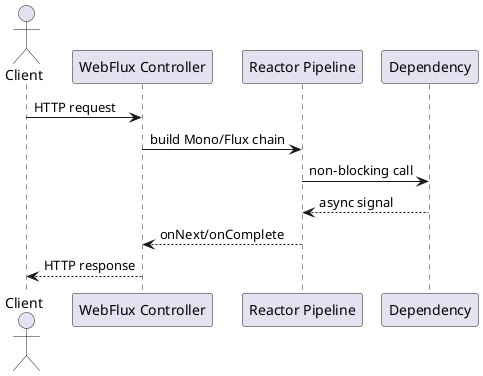

# Spring WebFlux and Reactor Overview

Video: https://youtu.be/q95g2RAFl9Y

**Purpose:** Explain reactive request processing in Spring WebFlux using Reactor and when it is an effective design choice.

**Outcomes**
- Explain `Mono` and `Flux` at an architectural level
- Recognize when reactive pipelines improve service behavior
- Identify common misuse patterns and operational risks

## Overview
Spring WebFlux uses a reactive, non-blocking model built on Project Reactor. Requests are represented as asynchronous streams (`Mono` for 0..1, `Flux` for 0..N).

## Why It Matters
In I/O-heavy systems, thread-per-request models can saturate quickly during dependency latency spikes. Reactive pipelines improve concurrency while applying backpressure and explicit flow control.

## Core Concepts
- `Mono<T>`: async single-result or empty sequence
- `Flux<T>`: async multi-item stream
- Operator chains: transform, filter, compose, recover
- Backpressure: demand-aware flow between stages
- Scheduler boundaries: control where work executes

## Example: Aggregate with Mono.zip
```java
@GetMapping("/dashboard/{id}")
public Mono<DashboardDto> dashboard(@PathVariable String id) {
  Mono<User> user = userClient.getUser(id);
  Mono<List<Order>> orders = orderClient.getOrders(id);

  return Mono.zip(user, orders)
      .map(t -> new DashboardDto(t.getT1(), t.getT2()));
}
```

## Example: Timeout and Fallback
```java
return inventoryClient.check(sku)
    .timeout(Duration.ofMillis(300))
    .onErrorReturn(InventoryStatus.unknown());
```

## Diagram


## When to Use
- High-concurrency APIs with variable downstream latency
- Streaming endpoints (SSE) and event-driven workflows
- Services already using reactive drivers and libraries

## When Not to Use
- Mostly blocking dependencies (JDBC, blocking SDKs)
- Teams without reactive debugging and observability readiness
- Simple CRUD services with modest traffic

## Architectural Tradeoffs
- Throughput: strong under I/O-heavy concurrency
- Complexity: operator chains can be hard to debug
- Reliability: backpressure helps but requires careful tuning
- Operations: needs tracing and metrics across async boundaries

## Common Pitfalls
- Mixing blocking calls in reactive chains
- Unbounded `flatMap` concurrency
- Ignoring timeout, retry, and cancellation policy
- Overusing reactive style where synchronous is simpler

## Quick Recap
WebFlux and Reactor are powerful for non-blocking, high-concurrency I/O workloads when used with end-to-end reactive dependencies and disciplined operations.
