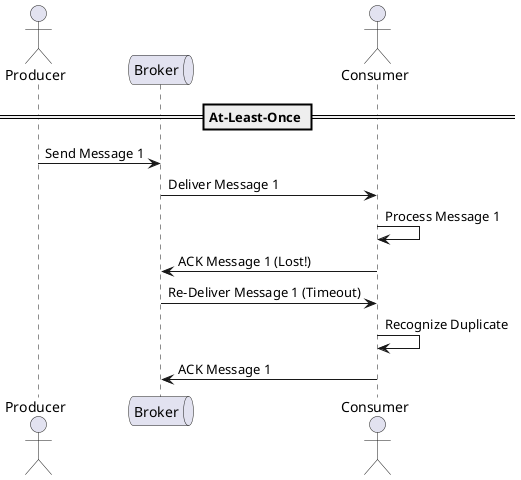

# Delivery Semantics

**Purpose:** Explores the guarantees a message broker provides when moving data between systems and the tradeoffs of each approach.

Video: https://youtu.be/CEHvlHWh0hU

**Outcomes**
- Define "At-Most-Once", "At-Least-Once", and "Exactly-Once" delivery
- Recognize how network failures impact delivery guarantees
- Design systems that can handle duplicate messages (idempotency)

## Overview
When sending a message over a network, failure is inevitable. The "Delivery Semantics" of a system define what happens when things go wrong.

---

## Core Concepts

### 1. At-Most-Once (Fire and Forget)
The message is sent, but no acknowledgment is required.
- **Guarantee:** 0 or 1 delivery.
- **Failures:** If the network drops the message or the consumer crashes, it is lost forever.
- **Pros:** Lowest latency, highest throughput.
- **Use Case:** High-volume telemetry (e.g., CPU metrics, mouse movements).

### 2. At-Least-Once (Acknowledged Delivery)
The producer retries sending until it receives an acknowledgment from the consumer.
- **Guarantee:** 1 or more deliveries.
- **Failures:** If an ACK is lost, the producer sends the message again.
- **Pros:** No data loss.
- **Cons:** Consumers **must** be prepared for duplicate messages.
- **Use Case:** Payments, order processing, state changes.

### 3. Exactly-Once
The system ensures the message is processed exactly once by the consumer.
- **Guarantee:** Exactly 1 logical processing.
- **Reality:** Achieved via **At-Least-Once + Idempotency** or distributed transactions (expensive).
- **Pros:** Simplest mental model for developers.
- **Cons:** Significant performance overhead; hard to achieve end-to-end.

---

## Code Examples

### Go: At-Most-Once (UDP / Fire-and-Forget)
```go
func sendMetric(metric string) {
    conn, _ := net.Dial("udp", "metrics:8125")
    fmt.Fprintf(conn, metric) // No check for receipt
}
```

### Python: At-Least-Once (RabbitMQ / Retries)
```python
def publish_with_retry(channel, message):
    while True:
        try:
            channel.basic_publish(
                exchange='',
                routing_key='task_queue',
                body=message,
                properties=pika.BasicProperties(delivery_mode=2) # Persistent
            )
            break # Success
        except pika.exceptions.AMQPError:
            time.sleep(1) # Retry logic
```

### Java: Handling At-Least-Once (Idempotent Consumer)
```java
public void onMessage(OrderEvent event) {
    if (processedStore.exists(event.id)) {
        log.info("Duplicate detected, skipping: " + event.id);
        return;
    }
    
    process(event);
    processedStore.save(event.id);
}
```

---

## Design Diagram



## Risks and Tradeoffs
- **Ghost Messages:** In "At-Most-Once," you cannot assume the data arrived.
- **Write Amplification:** "At-Least-Once" increases system load due to retries and idempotency checks.
- **Transactional Overhead:** True "Exactly-Once" (like Kafka's EOS) requires complex coordination between the producer, broker, and consumer.
