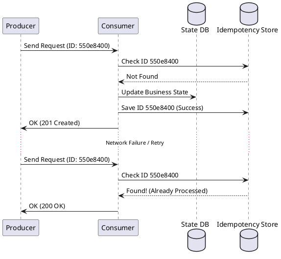

# Designing Idempotent Consumers

**Purpose:** Provides practical strategies for building services that can process the same message multiple times without changing the system state beyond the initial call.

**Outcomes**
- Explain the necessity of idempotency in distributed systems
- Implement "Idempotency Keys" and "De-duplication Stores"
- Distinguish between natural and synthetic idempotency

## Overview
In a system with **At-Least-Once** delivery, consumers will eventually receive duplicate messages. Idempotency is the property where an operation can be applied multiple times without changing the result beyond the first application.

---

## Core Concepts

### 1. Natural Idempotency
Some operations are inherently idempotent.
- **Example:** Setting a status to "ACTIVE". No matter how many times you set it, the final state is "ACTIVE".
- **Mathematical Analogy:** `f(x) = f(f(x))`

### 2. Synthetic Idempotency (The De-duplication Pattern)
Operations that are NOT naturally idempotent (e.g., "Withdraw $50") must be made idempotent using a unique identifier.
- **Idempotency Key:** A unique ID (often a UUID) generated by the producer for each unique request.
- **De-duplication Store:** A fast, persistent store (like Redis or a SQL table) that keeps track of processed keys.

---

## De-duplication Workflow
1. Consumer receives a message with an `Idempotency-Key`.
2. Consumer checks if the key exists in the de-duplication store.
3. If it exists, skip processing (it's a duplicate).
4. If it doesn't exist, process the message and save the key in a single transaction.

---

## Code Examples

### Node.js: Express Middleware for API Idempotency
```javascript
async function idempotencyGuard(req, res, next) {
  const key = req.header('X-Idempotency-Key');
  if (!key) return next();

  const existing = await cache.get(key);
  if (existing) {
    return res.status(200).send(existing); // Return cached response
  }

  res.on('finish', () => cache.set(key, res.body));
  next();
}
```

### Python: Handling Duplicates in a Message Handler
```python
def on_payment_received(msg):
    # Check if we've already handled this payment ID
    if db.payments.find_one({"idempotency_key": msg.id}):
        logger.info(f"Duplicate payment {msg.id} - ignoring.")
        return

    # Process payment
    db.payments.insert_one({
        "idempotency_key": msg.id,
        "amount": msg.amount,
        "status": "processed"
    })
```

### Go: Atomic Upsert (Database Level Idempotency)
```go
func processOrder(order Order) error {
    // Using PostgreSQL "ON CONFLICT DO NOTHING"
    query := `INSERT INTO orders (id, user_id, amount) 
              VALUES ($1, $2, $3) 
              ON CONFLICT (id) DO NOTHING`
    
    _, err := db.Exec(query, order.ID, order.UserID, order.Amount)
    return err
}
```

---

## Design Diagram



## Risks and Tradeoffs
- **Key Expiration:** De-duplication stores cannot grow forever. You must decide on an expiration period (TTL) based on the maximum expected retry window.
- **Transactional Integrity:** Ideally, the business logic and the idempotency record should be updated in a single atomic transaction.
- **State Leakage:** If a process fails *after* business logic but *before* saving the idempotency key, a retry will re-run the logic (dangerous for non-atomic operations).
