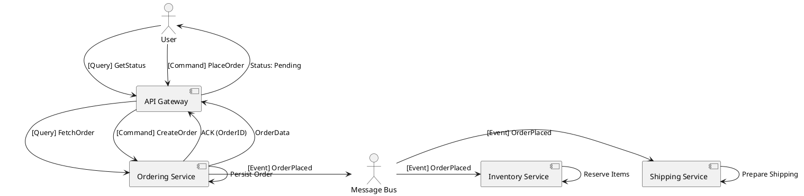

# Events, Commands, and Queries

Video: https://youtu.be/BDxTHvLn7sI

**Purpose:** Differentiates the three primary message types in distributed systems and explains when to use each to maintain decoupled, maintainable architectures.

**Outcomes**
- Define the semantic differences between Events, Commands, and Queries
- Apply each pattern to real-world distributed system interactions
- Understand the architectural impact on coupling and scalability

## Overview
In a distributed system, how services communicate determines their level of coupling. "Events, Commands, and Queries" (ECQ) provide a semantic framework for defining these interactions.

## Core Concepts

### 1. Commands
A **Command** is an instruction to perform a specific action.
- **Intent:** "Do this."
- **Ownership:** The sender knows who should handle it (targeted).
- **Outcome:** Usually results in a state change.
- **Example:** `ProcessPayment`, `ShipOrder`.

### 2. Events
An **Event** is a notification that something has happened in the past.
- **Intent:** "This happened."
- **Ownership:** The sender doesn't care who listens (broadcast).
- **Outcome:** Downstream services react to the change.
- **Example:** `PaymentProcessed`, `OrderShipped`.

### 3. Queries
A **Query** is a request for information without changing state.
- **Intent:** "Tell me this."
- **Outcome:** Returns data; must be idempotent and side-effect free.
- **Example:** `GetOrderStatus`, `CalculateTotal`.

---

## Architectural Comparison

| Feature | Command | Event | Query |
| :--- | :--- | :--- | :--- |
| **Perspective** | Future (Instruction) | Past (Fact) | Present (State) |
| **Coupling** | High (Targeted) | Low (Decoupled) | Medium (Targeted) |
| **Naming** | Imperative (`CreateUser`) | Past Tense (`UserCreated`) | Question (`GetUser`) |
| **Side Effects** | Yes | No (The event *is* the result) | No |

---

## Code Examples

### Go: Command Pattern (Targeted Dispatch)
```go
type CreateUserCommand struct {
    UserID   string
    Username string
}

// Command Handler
func HandleCreateUser(cmd CreateUserCommand) error {
    // Logic to persist user
    fmt.Printf("Creating user %s\n", cmd.Username)
    return nil
}
```

### Python: Event Pattern (Pub/Sub)
```python
class UserCreatedEvent:
    def __init__(self, user_id, timestamp):
        self.user_id = user_id
        self.timestamp = timestamp

# Event Publisher
def on_user_signup(user_id):
    event = UserCreatedEvent(user_id, "2024-03-24T12:00:00Z")
    bus.publish("user.events", event)
```

### Java: Query Pattern (Read-Only)
```java
public class GetOrderQuery {
    private final String orderId;

    public GetOrderQuery(String orderId) {
        this.orderId = orderId;
    }

    public String getOrderId() { return orderId; }
}

// Query Handler
public OrderResponse handle(GetOrderQuery query) {
    return repository.findById(query.getOrderId());
}
```

---

## Design Diagram



## Risks and Tradeoffs
- **Command Overuse:** Leads to "God Services" that orchestrate everything, creating tight coupling.
- **Event Spaghetti:** Hard to trace the flow of a single business process when it's scattered across many reactive events.
- **Query Latency:** In microservices, queries often require data from multiple sources (leading to API Composition or CQRS).
