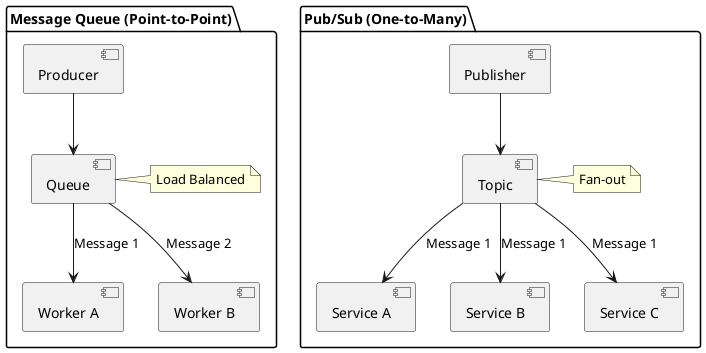

# Pub/Sub vs. Message Queues

Video: https://youtu.be/Hjr_vw90lQA 

**Purpo

**Outco
- Contrast the semantics of Message Queues and Pub/Sub
- Identify appropriate use cases for each pattern
- Analyze the impact on system scalability and consumer competition

## Overview
Asynchronous communication in distributed systems typically falls into two categories: **Message Queues** (Point-to-Point) and **Publish/Subscribe** (One-to-Many). Choosing the wrong one can lead to missed messages or unintended side effects.

## Core Concepts

### 1. Message Queues (Point-to-Point)
A queue acts as a buffer between a producer and one or more consumers.
- **Delivery Model:** Each message is delivered to exactly **one** consumer.
- **Consumer Competition:** If multiple consumers listen to the same queue, they "compete" for messages (load balancing).
- **Persistence:** Messages stay in the queue until they are acknowledged as processed.
- **Use Case:** Work distribution, background tasks (e.g., resizing an image).

### 2. Publish/Subscribe (Pub/Sub)
A publisher sends a message to a "topic," and the system fans it out to all interested subscribers.
- **Delivery Model:** Each message is delivered to **all** active subscribers.
- **Coupling:** The publisher has no knowledge of the subscribers.
- **Persistence:** Often transient (fire-and-forget), though modern systems (Kafka, Pulsar) allow for replayable logs.
- **Use Case:** System-wide notifications, broadcasting state changes (e.g., `OrderPlaced`).

---

## Architectural Comparison

| Feature | Message Queue | Pub/Sub |
| :--- | :--- | :--- |
| **Recipients** | One (Point-to-Point) | Many (Broadcast) |
| **Logic** | "Do this task" | "This happened" |
| **Consumer Scaling** | Horizontal scaling of workers | Independent services reacting differently |
| **Visibility** | Hidden from others | Visible to any subscriber |

---

## Code Examples

### Node.js: Queue Consumer (Competing Consumers)
```javascript
// Example using a generic queue library
const queue = messaging.connect('work_queue');

queue.consume((msg) => {
  console.log(`Worker ${process.pid} processing task: ${msg.id}`);
  processTask(msg.data);
  msg.ack(); // Message removed from queue
});
```

### Python: Pub/Sub Subscriber (Broadcasting)
```python
# Multiple services can subscribe to the same topic
import pubsub_lib as pub

def on_order_created(event):
    print(f"Inventory Service: Reserving stock for order {event.id}")

pub.subscribe("orders.v1.created", on_order_created)
```

### Go: Hybrid (Consumer Groups)
Modern systems like Kafka or RabbitMQ (via exchanges) often allow "Consumer Groups" which combine both patterns.
```go
// Kafka example: Subscribers in the same group act like a queue
// Subscribers in different groups act like Pub/Sub
reader := kafka.NewReader(kafka.ReaderConfig{
    Brokers: []string{"localhost:9092"},
    Topic:   "user-logs",
    GroupID: "analytics-engine", // Groups consumers together
})
```

---

## Design Diagram



## Risks and Tradeoffs
- **Queue Backlogs:** If consumers are too slow, the queue grows, consuming memory/disk and increasing latency.
- **Pub/Sub Reliability:** In pure Pub/Sub, if a subscriber is offline when a message is sent, they may miss it entirely (unless using "durable subscriptions").
- **Message Ordering:** Maintaining order is significantly harder in a competing consumer (queue) model than in a single-consumer model.
