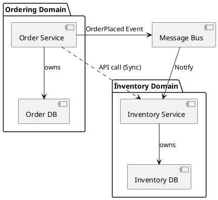

# Database per Service

**Purpose:** Explains the fundamental pattern of isolating data at the service level to ensure loose coupling and independent scalability.

**Outcomes**
- Define the "Database per Service" pattern and its benefits.
- Recognize the challenges of cross-service data consistency and querying.
- Evaluate strategies for sharing data between isolated services (Events vs. APIs).

---

## Overview
In a microservices architecture, the core goal is independent deployability and scalability. To achieve this, each service must own its data. If multiple services share a single database, changes in one service's schema can break another, leading to a "Distributed Monolith."

## Core Concepts

### 1. Data Isolation
Each service has its own private database. Other services can only access this data through the owner service's API (Commands or Queries) or by subscribing to its Events.
- **Pros:** Encapsulation, independent scaling, choice of the best DB for the job (polyglot persistence).
- **Cons:** Complex cross-service queries, eventual consistency, operational overhead.

### 2. Polyglot Persistence
Since each service has its own DB, you can choose the technology that fits the workload.
- **Example:** Order Service uses PostgreSQL (ACID), Recommendation Service uses Neo4j (Graph), and Search Service uses Elasticsearch (Search).

---

## Cross-Service Data Retrieval Strategies

### 1. API Composition (Join in Memory)
The calling service calls multiple services and joins the results in its own application logic.
- **Use Case:** Simple data aggregation.
- **Tradeoff:** Latency (multiple network calls), increased memory usage.

### 2. CQRS / Materialized Views
Services emit events when their data changes. Other services subscribe to these events and build a local "read-only" copy of the data they need.
- **Use Case:** High-performance queries across multiple services.
- **Tradeoff:** Eventual consistency, data duplication.

---

## Code Examples

### Go: Repository Isolation
```go
// OrderRepository encapsulates access to the Orders database
type OrderRepository struct {
    db *sql.DB
}

func (r *OrderRepository) GetOrderByID(id string) (*Order, error) {
    // Only this service touches the orders table
    return r.queryDatabase(id)
}
```

### Python: Cross-Service API Composition
```python
def get_order_details(order_id):
    # Call Order Service
    order = requests.get(f"http://order-service/orders/{order_id}").json()
    
    # Call User Service for customer info
    user = requests.get(f"http://user-service/users/{order['user_id']}").json()
    
    return {**order, "customer": user}
```

### Java: Event-Driven Materialized View (Consumer)
```java
@KafkaListener(topics = "user-events")
public void onUserUpdate(UserUpdatedEvent event) {
    // Update local read-only cache of user data
    userCache.save(new UserReadModel(event.getUserId(), event.getName()));
}
```

---

## Design Diagram



## Risks and Tradeoffs
- **Complexity:** Managing many small databases is operationally harder than one large one.
- **Distributed Joins:** Queries that used to be a simple SQL JOIN now require complex orchestration.
- **Data Integrity:** Ensuring consistency across services without 2PC (Two-Phase Commit) requires Saga patterns or eventual consistency models.
