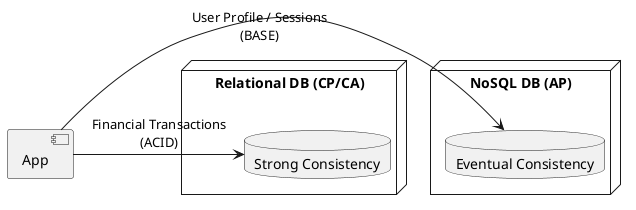

# Relational vs. NoSQL Tradeoffs

Video: https://youtu.be/PJ59YDABKD4

**Purpose:** Explores the architectural decision-making process when choosing between relational (SQL) and non-relational (NoSQL) data stores in a distributed system.

**Outcomes**
- Contrast ACID and BASE consistency models.
- Apply the CAP Theorem to database selection.
- Identify common NoSQL categories and their primary use cases.

---

## Overview
The "One Size Fits All" database era is over. Modern distributed systems often use multiple types of databases (Polyglot Persistence) to meet different requirements for scale, consistency, and data structure.

## Core Concepts

### 1. The CAP Theorem
In a distributed system, you can only provide two of the three following guarantees:
- **Consistency:** Every read receives the most recent write or an error.
- **Availability:** Every request receives a (non-error) response, without the guarantee that it contains the most recent write.
- **Partition Tolerance:** The system continues to operate despite an arbitrary number of messages being dropped or delayed by the network between nodes.

*Note: In the real world, network partitions are inevitable, so the choice is usually between CP and AP.*

### 2. ACID vs. BASE
- **ACID (Relational):** Atomicity, Consistency, Isolation, Durability. Focuses on strong consistency and reliable transactions.
- **BASE (NoSQL):** Basically Available, Soft state, Eventual consistency. Focuses on high availability and horizontal scalability.

---

## Data Models

| Model | Type | Best For | Examples |
| :--- | :--- | :--- | :--- |
| **Relational** | SQL | Complex joins, strong consistency, financial data. | PostgreSQL, MySQL |
| **Key-Value** | NoSQL | Caching, session management, simple lookups. | Redis, DynamoDB |
| **Document** | NoSQL | Product catalogs, content management, flexible schemas. | MongoDB, CouchDB |
| **Column-Family** | NoSQL | Time-series, logging, massive write throughput. | Cassandra, HBase |
| **Graph** | NoSQL | Social networks, fraud detection, complex relationships. | Neo4j, Amazon Neptune |

---

## Code Examples

### Java: Relational Transaction (ACID)
```java
@Transactional
public void transferFunds(String from, String to, BigDecimal amount) {
    accountRepo.withdraw(from, amount);
    accountRepo.deposit(to, amount);
    // Success is guaranteed for both or neither
}
```

### Node.js: Document Storage (Flexible Schema)
```javascript
// MongoDB: No pre-defined schema required
const product = {
    name: "Laptop",
    price: 1200,
    specs: { cpu: "i7", ram: "16GB" } // Nested objects are easy
};
await db.collection('products').insertOne(product);
```

### Go: Key-Value Store (High Performance)
```go
// Redis: Fast, simple access
err := rdb.Set(ctx, "session:123", userData, 30*time.Minute).Err()
val, err := rdb.Get(ctx, "session:123").Result()
```

---

## Design Diagram



## Risks and Tradeoffs
- **Complexity:** Managing multiple database types increases operational complexity and developer cognitive load.
- **Data Integrity:** Moving away from relational constraints means the application layer must often handle data integrity and validation.
- **Lock-in:** NoSQL databases often have proprietary APIs (e.g., DynamoDB), making it harder to switch providers compared to standard SQL.
