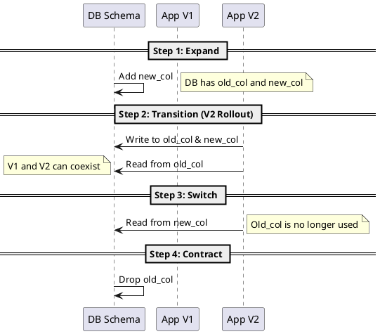

# Schema Evolution and Migrations

Video: https://youtu.be/q_sf2IZGpGk

**Purpose:** Provides a framework for evolving database schemas in a distributed system without downtime, focusing on backward compatibility and safety.

**Outcomes**
- Apply the "Expand and Contract" pattern to database changes.
- Identify "Breaking" vs "Non-breaking" schema changes.
- Implement automated migration pipelines that support safe rollbacks.

---

## Overview
In a monolithic system, schema changes and code changes happen together. In a distributed system, you cannot assume all instances of a service (or all services) will upgrade at once. Schema changes must be decoupled from code changes to maintain availability.

## Core Concepts

### 1. Breaking vs. Non-breaking Changes
- **Non-breaking:** Adding a new optional column, adding a table. These are safe to apply while old code is running.
- **Breaking:** Renaming a column, changing a data type, deleting a column. These require a multi-step orchestration.

### 2. The "Expand and Contract" Pattern
To perform a breaking change (like renaming a column) without downtime:
1. **Expand:** Add the *new* column to the database (nullable/optional).
2. **Migrate (Sync):** Update the application to write to *both* columns but read from the *old* one.
3. **Migrate (Data):** Run a background job to copy existing data from old to new.
4. **Switch:** Update the application to read from the *new* column.
5. **Contract:** Remove the *old* column from the database.

---

## Migration Tools and Best Practices
- **Version Control:** All schema changes must be stored in VCS (e.g., Flyway for Java, Alembic for Python).
- **Idempotency:** Migrations must be able to run multiple times without failing (e.g., `IF NOT EXISTS`).
- **Pre-deployment Checks:** Test migrations against a production-like dataset to catch performance issues before they hit production.

---

## Code Examples

### Java (Flyway): Expanding a Table
```sql
-- V1__Add_New_Column.sql
ALTER TABLE orders ADD COLUMN status_v2 VARCHAR(50);
-- Safe to apply while V1 code is running
```

### Python: Multi-Step Write logic
```python
# Transition state: Writing to both old and new
def update_order_status(order_id, new_status):
    # Write to old column for backward compatibility
    # Write to new column for the future
    db.execute("UPDATE orders SET status = %s, status_v2 = %s WHERE id = %s", 
               (new_status, new_status, order_id))
```

### Go: Checking Migration Version
```go
// Ensure the application only starts if the schema is compatible
func ensureSchemaVersion(db *sql.DB) error {
    version, _ := getCurrentSchemaVersion(db)
    if version < RequiredVersion {
        return fmt.Errorf("incompatible schema version: %d", version)
    }
    return nil
}
```

---

## Design Diagram



## Risks and Tradeoffs
- **Duration:** The Expand and Contract pattern is slow and requires multiple deployments.
- **Data Consistency:** Syncing data between columns in a high-traffic system can cause lock contention or race conditions.
- **Testing:** You must test all three states: (Old Code + Old DB), (Old Code + New DB), (New Code + New DB).
