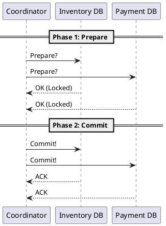

# Distributed Transactions

**Purpose:** Explains the theoretical and practical limitations of maintaining ACID properties across multiple networked services.

**Outcomes**
- Contrast Local Transactions with Distributed Transactions.
- Identify the impact of network latency and partial failures on consistency.
- Explain the role of a Transaction Coordinator (and why it's a bottleneck).

---

## Overview
In a monolith with a single database, transactions are simple: either everything is committed or nothing is. In a distributed system, a single business operation might span multiple databases and services. This is the realm of Distributed Transactions.

## Core Concepts

### 1. The Fallacy of Distributed Transactions
Attempting to maintain strong ACID consistency across services often leads to:
- **Availability Issues:** If the Transaction Coordinator or any participating service is down, the entire transaction fails.
- **Performance Issues:** Distributed locks must be held across the network, leading to high latency and contention.

### 2. Atomic Commit Protocols
How do we ensure all participants agree on the outcome?
- **Coordinator:** The central node that manages the transaction state.
- **Participants:** The services or databases performing the actual work.

---

## The Reality of Scale
At high scale, "Strong Consistency" is traded for "Eventual Consistency." Instead of trying to lock everything at once, we perform local transactions and propagate changes through events (see Sagas).

---

## Code Examples

### Java: JTA (Java Transaction API) - Traditional 2PC
```java
@Transactional
public void processDistributedOrder(Order order) {
    // Both resources must support XA transactions
    inventoryService.reserve(order.sku);
    paymentService.charge(order.amount);
}
```

### Python: Manual Coordination (Pseudo-Distributed)
```python
def create_order(order_data):
    # This is NOT a real distributed transaction
    # Failure in step 2 leaves step 1 committed (Data Inconsistency!)
    db.orders.insert(order_data)
    response = requests.post("http://inventory/reserve", json=order_data)
    if response.status_code != 200:
        # We must manually roll back step 1
        db.orders.delete(order_data['id'])
```

### Go: Transactional Outbox Pattern (A Better Alternative)
```go
func saveOrderAndEvent(order Order) error {
    return db.Transaction(func(tx *sql.Tx) error {
        // 1. Save the order
        tx.Exec("INSERT INTO orders...", order)
        // 2. Save the event in the SAME transaction
        tx.Exec("INSERT INTO outbox...", order.ToEvent())
        return nil
    })
}
```

---

## Design Diagram



## Risks and Tradeoffs
- **Blocking:** 2PC is a blocking protocol. If the coordinator fails during the commit phase, participants may be left with locked resources indefinitely.
- **Throughput:** The coordination overhead and network round-trips significantly limit the number of transactions per second.
- **Service Autonomy:** Distributed transactions tightly couple the uptime and performance of multiple services.
