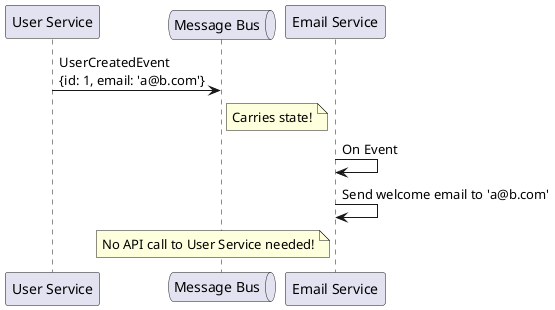

# Event Carried State Transfer

**Purpose:** Explains how to reduce service coupling by including required data within events, allowing services to operate autonomously without synchronous lookups.

**Outcomes**
- Contrast Event Notifications with Event Carried State Transfer.
- Identify the impact on service autonomy and data consistency.
- Explain the tradeoffs between event size and coupling.

---

## Overview
When a service reacts to an event, it often needs more data than just "this ID changed."
- **Event Notification:** "User 123 updated." -> Consumer must call `GET /users/123`.
- **Event Carried State Transfer (ECST):** "User 123 updated. New Name: Jane, Email: jane@...". -> Consumer has everything it needs.

## Core Concepts

### 1. Reducing Coupling
By including state in the event, the consumer no longer depends on the availability of the producer for basic information. This improves the overall system's resilience.

### 2. Autonomous Services
Each service can build its own "read model" from the state carried in events. This makes them faster (local lookups) and more reliable (no network dependency during a request).

---

## The Tradeoffs

| Feature | Event Notification | Event Carried State |
| :--- | :--- | :--- |
| **Coupling** | High (Needs API lookup) | Low (Data is in event) |
| **Event Size** | Small (ID only) | Large (Full payload) |
| **Staleness** | Low (Real-time lookup) | High (Eventual consistency) |
| **Autonomy** | Low | High |

---

## Code Examples

### Java: Producing an ECST Event
```java
public void onUserUpdate(User user) {
    // Include full user state, not just ID
    UserUpdatedEvent event = new UserUpdatedEvent(
        user.getId(), 
        user.getName(), 
        user.getEmail()
    );
    bus.publish("user.updated", event);
}
```

### Python: Consuming and Storing Local State
```python
# Analytics Service
def on_user_updated(event):
    # Store local copy for autonomous analytics queries
    db.local_user_cache.upsert({
        "id": event.user_id,
        "email_domain": event.email.split('@')[1]
    })
```

### Go: Minimal state vs Full state
```go
// Choice between minimal and full impact
type OrderPlacedEvent struct {
    OrderID string // Minimal
    Items   []Item // Carried state
    Total   float64
}
```

---

## Design Diagram



## Risks and Tradeoffs
- **Data Duplication:** The same data is stored in many places.
- **Stale Data:** If events are processed slowly, a service might use an old name or address.
- **Event Size:** Carrying too much state can bloat events, increasing network costs and storage for message brokers.
- **Contract Versioning:** Changes to the state structure in an event can break all consumers (Tight Schema Coupling).
