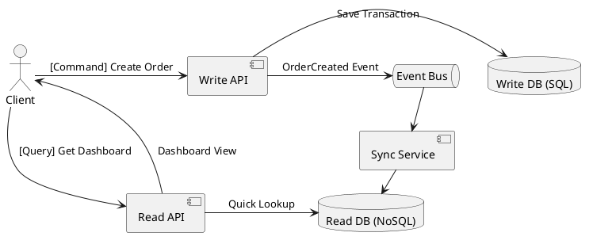

# Read Models and CQRS Lite

**Purpose:** Explains how to separate read and write models to improve query performance and simplify service logic in complex distributed systems.

**Outcomes**
- Contrast Command models with Read models.
- Identify when to apply "CQRS Lite" vs. full CQRS.
- Implement a basic read model using asynchronous event processing.

---

## Overview
As a system grows, the way data is written (optimized for consistency and normalization) often conflicts with the way it needs to be read (optimized for UI and search). **Command Query Responsibility Segregation (CQRS)** solves this by separating the model for updates from the model for reads.

## Core Concepts

### 1. The Command Model (Write)
- **Goal:** Ensuring data integrity and applying business rules.
- **Form:** Often highly normalized (SQL) or domain-driven.

### 2. The Read Model (Query)
- **Goal:** Responding to queries as fast as possible.
- **Form:** Denormalized, pre-joined, and often stored in a different technology (Elasticsearch, Redis, or flat SQL tables).

### 3. "CQRS Lite"
Traditional CQRS often includes Event Sourcing, which is highly complex. "CQRS Lite" simply uses events to sync a separate read-optimized database or table from a primary write-optimized database.

---

## The Synchronization Gap
Because the read model is updated via events, there is always a delay between the write and the read.
- **Property:** Eventual Consistency.
- **UX Strategy:** Use "Optimistic UI" or "Query from the write model" for the immediate user who made the change.

---

## Code Examples

### Java: Denormalizing a Read Model (Consumer)
```java
// Combining User and Order data into a single "OrderDashboard" record
@KafkaListener(topics = "order-events")
public void onOrder(OrderEvent event) {
    User user = userService.get(event.getUserId());
    DashboardRecord record = new DashboardRecord(
        event.getOrderId(), 
        user.getName(), 
        event.getAmount()
    );
    readModelRepo.save(record); // Pre-joined for the UI
}
```

### Node.js: Querying a Read Model (Simple API)
```javascript
// Fast lookup without complex SQL JOINS
app.get('/orders/:id/dashboard', async (req, res) => {
    const data = await redis.get(`dashboard:${req.params.id}`);
    res.json(JSON.parse(data));
});
```

### Go: Emit Command Result
```go
func processCommand(cmd CreateOrderCommand) {
    order := db.Save(cmd)
    // Notify read models to update
    bus.Emit("order.created", order)
}
```

---

## Design Diagram



## Risks and Tradeoffs
- **Complexity:** Managing two data models and the synchronization logic between them is extra work.
- **Eventual Consistency:** Users may see old data immediately after an update, which can be confusing.
- **Consistency Risks:** If the sync process fails, the read model can become permanently out of sync with the write model (needs a "re-sync" mechanism).
