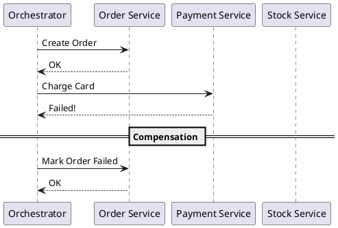

# Sagas vs. Two-Phase Commit

**Purpose:** Contrast the "all-or-nothing" strict consistency of Two-Phase Commit with the eventual consistency and resilient nature of the Saga pattern.

**Outcomes**
- Define the Saga pattern and "Compensating Transactions."
- Contrast Orchestration vs. Choreography in Sagas.
- Identify the tradeoffs between Strong and Eventual Consistency.

---

## Overview
As distributed systems scale, the rigid locks and blocking nature of Two-Phase Commit (2PC) become a liability. The **Saga Pattern** offers a different approach: a sequence of local transactions, where each step triggers the next. If a step fails, "compensating transactions" are executed to undo the previous steps.

## Core Concepts

### 1. Two-Phase Commit (2PC)
A centralized coordinator ensures all participants commit or none do.
- **Guarantee:** Strong consistency (Atomic).
- **Cons:** Blocking, high latency, "Coordinator bottleneck."

### 2. Sagas
A series of local ACID transactions.
- **Guarantee:** Eventual consistency.
- **Resilience:** Instead of undoing, you *compensate* (e.g., if you can't ship, you issue a refund).

---

## Saga Styles

### 1. Choreography
Participants exchange events without a centralized coordinator.
- **Pros:** Decentralized, simple for small processes.
- **Cons:** Hard to track the state of a complex business process (Spaghetti).

### 2. Orchestration
A central "Saga Orchestrator" tells participants what local transactions to execute.
- **Pros:** State is centralized, easier to debug and manage complex flows.
- **Cons:** Central point of logic and failure.

---

## Code Examples

### Java: Saga Orchestrator Logic
```java
// Simplified Orchestrator Step
public void nextStep(OrderSaga saga) {
    switch (saga.getState()) {
        case CREATED:
            paymentService.charge(saga.getOrderId());
            break;
        case PAYMENT_FAILED:
            orderService.cancel(saga.getOrderId()); // Compensate
            break;
        // ...
    }
}
```

### Python: Choreography (Event Handlers)
```python
# Payment Service
def on_order_created(event):
    if process_payment(event.amount):
        bus.emit("payment.succeeded", event.order_id)
    else:
        bus.emit("payment.failed", event.order_id)

# Order Service
def on_payment_failed(event):
    mark_order_cancelled(event.order_id) # Compensating action
```

### Node.js: Compensating Action
```javascript
// Reverting a state change is a "compensating transaction"
async function compensate(orderId) {
    await db.orders.update({ id: orderId }, { status: 'CANCELLED_AND_REFUNDED' });
    console.log(`Order ${orderId} has been compensated.`);
}
```

---

## Design Diagram



## Risks and Tradeoffs
- **Complexity:** Designing compensating transactions for every step is a lot of work.
- **Anomalies:** Since local transactions are committed immediately, other users might see a "partial" state (e.g., stock is reserved, but order isn't finished).
- **Debugging:** Following a business process across many services and events is harder than a single SQL transaction.
