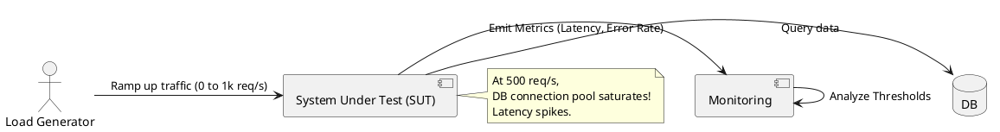

# Capacity and Load Testing

**Purpose:** Provides a framework for identifying the performance limits of a distributed system before they are reached by production traffic.

**Outcomes**
- Contrast Load Testing, Stress Testing, and Soak Testing.
- Identify common bottlenecks (CPU, Memory, Network, DB Connections).
- Define SLIs (Service Level Indicators) and SLOs (Service Level Objectives) based on test data.

---

## Overview
How many users can your system handle? At what point will it fail? These are the questions load testing aims to answer. In a distributed system, the bottleneck is rarely where you think it is.

## Core Testing Types

### 1. Load Testing
Testing with an expected volume of users to ensure performance meets requirements.

### 2. Stress Testing (Breakpoint Testing)
Increasing the load until the system breaks to identify the "weakest link."

### 3. Soak Testing (Endurance Testing)
Running a steady load for a long period (e.g., 24 hours) to identify memory leaks and resource exhaustion.

### 4. Spike Testing
Rapidly increasing load to test how quickly the system can scale or if it crashes under sudden bursts.

---

## Key Metrics (The "Golden Signals")

- **Latency:** Time taken to service a request.
- **Traffic:** Demand placed on the system.
- **Errors:** Rate of requests that fail.
- **Saturation:** How "full" the service is (e.g., thread pool usage).

---

## Code Examples

### Go: Simple HTTP Load Generator (Custom Script)
```go
func hammer(url string, workers int) {
    for i := 0; i < workers; i++ {
        go func() {
            for {
                http.Get(url)
            }
        }()
    }
}
```

### Python: Locust (Load Testing Tool)
```python
class UserBehavior(HttpUser):
    @task
    def purchase(self):
        # Simulate a real user interaction
        self.client.post("/api/buy", json={"item": "123"})
```

### Node.js: Autocannon (High-Performance Benchmarking)
```bash
# Command line tool to benchmark a service
npx autocannon -c 100 -d 10 http://localhost:8080/health
```

---

## Design Diagram



## Risks and Tradeoffs
- **Cost:** Large-scale load tests can be expensive (compute, network bandwidth).
- **Environment Parity:** Results from a staging environment rarely match production 1:1.
- **Data Cleanup:** Load tests can pollute databases with millions of "junk" records.
- **Cascading Failure:** If a load test isn't properly isolated, it can accidentally crash other parts of your infrastructure.
