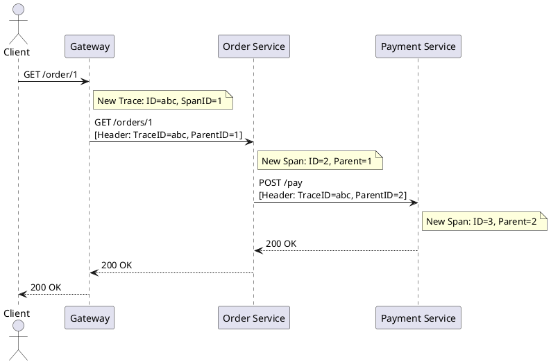

# Distributed Tracing Basics

**Purpose:** Explains how to follow a single request's journey across multiple microservices to identify performance bottlenecks and understand system behavior.

**Outcomes**
- Contrast Correlation IDs with Trace/Span IDs.
- Identify the components of a Trace (Spans, Root Span, Parent/Child).
- Implement context propagation across service boundaries.

---

## Overview
In a monolithic system, tracing a request is easy: it's all in one process. In a distributed system, a single user request might trigger dozens of service-to-service calls. Without tracing, it is impossible to know where time is being spent or why a specific request failed.

## Core Concepts

### 1. Spans and Traces
- **Span:** A single unit of work (e.g., an HTTP request, a DB query). It has a name, start time, and duration.
- **Trace:** A collection of spans that share a single **Trace ID**, representing the entire journey of a request.
- **Root Span:** The first span in a trace (e.g., at the API Gateway).

### 2. Context Propagation
To link spans together, services must pass the Trace ID and Parent Span ID to the next service in the chain.
- **Common Implementation:** HTTP headers (e.g., `traceparent` from the W3C Trace Context standard).

---

## The Components of a Trace

| Component | Description |
| :--- | :--- |
| **Trace ID** | Unique ID for the entire request journey. |
| **Span ID** | Unique ID for a single unit of work. |
| **Parent ID** | ID of the span that triggered the current one. |
| **Annotations / Tags** | Metadata attached to a span (e.g., `http.method=GET`). |

---

## Code Examples

### Python: Context Propagation (Flask)
```python
# Service A: Outgoing call
def call_service_b():
    trace_id = get_current_trace_id()
    # Pass trace context in headers
    headers = {'X-Trace-Id': trace_id}
    requests.get("http://service-b/api", headers=headers)

# Service B: Incoming call
@app.before_request
def start_trace():
    trace_id = request.headers.get('X-Trace-Id')
    set_current_trace_id(trace_id)
```

### Go: W3C Trace Context (Middleware)
```go
func tracingMiddleware(next http.Handler) http.Handler {
    return http.HandlerFunc(func(w http.ResponseWriter, r *http.Request) {
        // Automatically extracts traceparent header
        ctx := otel.GetTextMapPropagator().Extract(r.Context(), propagation.HeaderCarrier(r.Header))
        next.ServeHTTP(w, r.WithContext(ctx))
    })
}
```

### Java: OpenTelemetry Manual Instrumentation
```java
// Adding metadata to a trace
Span span = Span.current();
span.setAttribute("user.id", "99");
span.addEvent("Processing started");
```

---

## Design Diagram



## Risks and Tradeoffs
- **Complexity:** Every single service in your system must correctly propagate headers.
- **Overhead:** Generating and sending trace data (spans) for every request can slow down the system.
- **Data Volume:** Storing full traces for high-traffic systems is prohibitively expensive (necessitating sampling).
