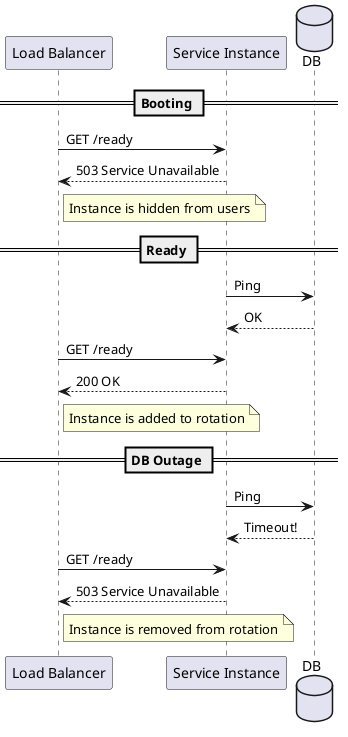

# Health and Readiness

**Purpose:** Explains how to implement effective health checks that allow container orchestrators to manage service lifecycles without causing downtime.

**Outcomes**
- Contrast Liveness vs. Readiness vs. Startup probes.
- Identify what should (and shouldn't) be included in a health check.
- Implement a multi-component health endpoint.

---

## Overview
In a distributed system, a service instance can be in many states. It might be starting up, it might be running but disconnected from its database, or it might be totally dead. **Health Probes** allow the infrastructure (e.g., Kubernetes) to react correctly to these states.

## Core Concepts

### 1. Liveness (Is it alive?)
- **Action:** If this fails, the orchestrator **restarts** the instance.
- **Fail When:** Deadlock, infinite loop, process crashed.
- **DANGER:** Do not fail liveness because a downstream dependency is down (this causes "restart storms").

### 2. Readiness (Is it ready to work?)
- **Action:** If this fails, the orchestrator **stops sending traffic** to this instance.
- **Fail When:** Connecting to DB, warming up cache, downstream dependency is unreachable.

### 3. Startup (Has it finished booting?)
- **Action:** Disables liveness/readiness checks until this passes.
- **Use Case:** Legacy apps with slow boot times.

---

## What to Check?

| Component | Liveness | Readiness |
| :--- | :--- | :--- |
| **Internal CPU/RAM** | Yes | Yes |
| **Database Connection** | No | **Yes** |
| **Message Broker** | No | **Yes** |
| **Downstream APIs** | No | Maybe (use circuit breakers) |

---

## Code Examples

### Node.js: Express Health Endpoint
```javascript
app.get('/health/ready', async (req, res) => {
    const dbStatus = await checkDb();
    const redisStatus = await checkRedis();
    
    if (dbStatus && redisStatus) {
        res.status(200).send({ status: 'UP' });
    } else {
        res.status(503).send({ status: 'DOWN' });
    }
});
```

### Go: Standard Library Health Check
```go
func healthHandler(w http.ResponseWriter, r *http.Request) {
    // Simple liveness check
    w.WriteHeader(http.StatusOK)
    w.Write([]byte("OK"))
}
```

### Java: Spring Boot Actuator
```yaml
# application.yml
management:
  endpoints:
    web:
      exposure:
        include: health
  endpoint:
    health:
      show-details: always
      group:
        readiness:
          include: db, redis
```

---

## Design Diagram



## Risks and Tradeoffs
- **Shallow vs Deep Checks:** Deep checks (checking every dependency) can be slow and brittle. Shallow checks (just returning 200) can lead to users getting errors.
- **Cascading Failures:** If all instances fail readiness because a shared database is down, the load balancer will have no instances left (Total Outage).
- **Security:** Health endpoints often reveal sensitive info (DB versions, disk space). Secure or obfuscate details in production.
