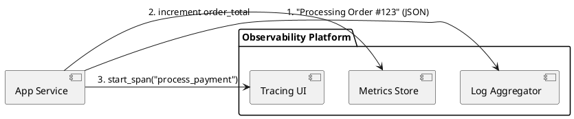

# Logs, Metrics, and Traces

**Purpose:** Explains the "Three Pillars of Observability" and how they provide different but complementary views into a distributed system's health and performance.

**Outcomes**
- Contrast Logs, Metrics, and Traces in terms of data volume and resolution.
- Identify which pillar to use for a given debugging or monitoring scenario.
- Implement structured logging and counter/gauge metrics.

---

## Overview
Observability is the ability to understand the internal state of a system based on its external outputs. In a distributed system, where failure is the norm, having the right data to diagnose "unknown unknowns" is critical.

## The Three Pillars

### 1. Logs (The "What")
Immutable, time-stamped records of discrete events.
- **Best For:** Detailed "forensics" on a specific request or error.
- **Format:** Prefer **Structured Logging** (JSON) over plain text.

### 2. Metrics (The "How Many")
Aggregated, numeric values over time.
- **Best For:** High-level system health, alerting, and identifying trends (e.g., CPU, Request Rate, Error Rate).
- **Types:** Counter (increments only), Gauge (can go up/down), Histogram (distribution).

### 3. Traces (The "Where")
A record of a single request's path through a distributed system.
- **Best For:** Identifying bottlenecks and latencies in cross-service interactions.
- **Key Concept:** Span (a single unit of work) and Trace (a collection of spans).

---

## Comparison Table

| Feature | Logs | Metrics | Traces |
| :--- | :--- | :--- | :--- |
| **Data Type** | Text/JSON | Numeric | Graph of Spans |
| **Resolution** | High (Detail) | Low (Aggregated) | High (Request-level) |
| **Storage Cost** | High | Low | Medium (often sampled) |
| **Alerting** | Poor | Excellent | Good |

---

## Code Examples

### Node.js: Structured Logging
```javascript
const logger = pino();
// DO THIS: JSON format for machine parsing
logger.info({ 
    event: 'order_processed', 
    orderId: '550', 
    duration_ms: 120 
});
```

### Go: Prometheus Metrics
```go
var requestCounter = prometheus.NewCounter(prometheus.CounterOpts{
    Name: "http_requests_total",
    Help: "Total number of HTTP requests.",
})

func handler(w http.ResponseWriter, r *http.Request) {
    requestCounter.Inc()
    // handle request...
}
```

### Java: Creating a Span (Micrometer/OpenTelemetry)
```java
Span span = tracer.nextSpan().name("db-query").start();
try (var scope = tracer.withSpan(span)) {
    return repository.findById(id);
} finally {
    span.end();
}
```

---

## Design Diagram



## Risks and Tradeoffs
- **Cost:** Logs can be very expensive to store and index.
- **Cardinality:** Metrics with too many labels (e.g., adding `user_id` as a label) can crash your metrics database.
- **Overhead:** Tracing every single request can add significant latency; most systems use **Sampling** (e.g., trace only 1% of requests).
