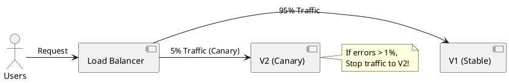

# Deployment Strategies

**Purpose:** Explains different methods for rolling out new code to a distributed system while minimizing risk and downtime.

**Outcomes**
- Contrast Blue/Green, Canary, and Rolling updates.
- Identify the role of "Feature Flags" in decoupled deployments.
- Apply a "Rollback Strategy" based on the chosen deployment method.

---

## Overview
How do you update a system that must never go down? In a distributed system, you rarely update everything at once. You use strategies that allow you to test new code in production with minimal impact.

## Core Strategies

### 1. Rolling Update
Gradually replaces old instances with new ones.
- **Pros:** No downtime; low resource overhead.
- **Cons:** Two versions of the code run simultaneously for a period (must handle backward compatibility).

### 2. Blue/Green Deployment
Maintain two identical environments: "Blue" (Current) and "Green" (New). Once Green is ready, switch all traffic at the Load Balancer level.
- **Pros:** Instant cutover; easy rollback (just switch back).
- **Cons:** High resource cost (doubles your infrastructure during deployment).

### 3. Canary Deployment
Route a small percentage (e.g., 5%) of users to the new version. If metrics look good, gradually increase the traffic.
- **Pros:** Real-world testing with minimal "Blast Radius."
- **Cons:** Complex traffic management; monitoring must be very sensitive.

---

## Deployment vs. Release
- **Deployment:** Moving the bits to production (the new code is running).
- **Release:** Turning on the new feature for users (e.g., via a feature flag).

---

## Code Examples

### Python: Simple Feature Flag
```python
def process_payment(amount):
    # Deployment is done, but Release is controlled by a flag
    if flags.is_enabled("use-new-stripe-v2"):
        return stripe_v2.charge(amount)
    else:
        return stripe_v1.charge(amount)
```

### Go: Rolling Update Configuration (Kubernetes)
```yaml
# deployment.yaml
spec:
  strategy:
    type: RollingUpdate
    rollingUpdate:
      maxUnavailable: 25%
      maxSurge: 1
```

### Java: Health-based Canary Termination
```java
// Logic to automatically rollback if error rate spikes in canary
if (canaryMetrics.errorRate() > 0.05) {
    deploymentService.rollback();
    log.error("Canary error rate too high! Rolling back.");
}
```

---

## Design Diagram



## Risks and Tradeoffs
- **State/Database Compatibility:** The hardest part of any deployment is ensuring the database schema supports both the old and new code simultaneously.
- **Configuration Drift:** Blue/Green environments must stay perfectly in sync or the switch will fail.
- **Observability:** Canary deployments are useless if your monitoring doesn't distinguish between V1 and V2 errors.
