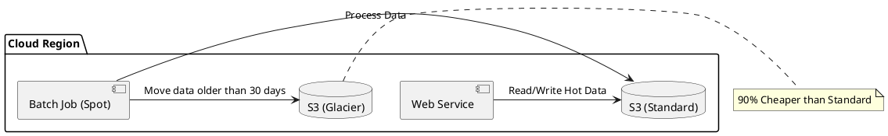

# Designing for Cost

**Purpose:** Provides a framework for making architectural decisions that consider the financial impact of cloud infrastructure, particularly in a distributed system.

**Outcomes**
- Identify the "Hidden Costs" of distributed systems (Egress, Storage, IOPS).
- Apply cost-saving patterns (Tiered Storage, Spot Instances, Compression).
- Evaluate the tradeoff between Performance and Cost.

---

## Overview
In the cloud, "Scalability" often means "Scalable Bills." A system that is technically perfect but financially unviable is a failed architecture. Designing for cost (FinOps) is a critical skill for senior engineers.

## The Pillars of Cloud Cost

### 1. Compute
The cost of CPU and RAM.
- **Saving Pattern:** Use **Auto-scaling** to match demand. Use **Spot Instances** for non-critical, fault-tolerant workloads (e.g., batch processing).

### 2. Networking (The Silent Killer)
The cost of moving data.
- **Egress:** Data leaving the cloud provider's network is expensive.
- **Cross-AZ/Region:** Moving data between availability zones or regions often carries a hidden cost.

### 3. Storage
The cost of persistence.
- **Saving Pattern:** Use **Tiered Storage**. Put hot data in SSD/NVMe (expensive), warm data in standard HDD, and cold data in Glacier/S3 (cheap).

---

## Cost-Aware Architectural Decisions

| Decision | Low Cost | High Cost |
| :--- | :--- | :--- |
| **Data Format** | Binary (Protobuf, Avro) | Text (JSON, XML) |
| **Scaling** | Horizontal (Small nodes) | Vertical (Mega-nodes) |
| **Consistency** | Eventual (Async) | Strong (Sync/Locked) |
| **Availability** | Single AZ | Multi-Region |

---

## Code Examples

### Go: Compressing Data for Egress Reduction
```go
// Compressing a message before sending it over the network
func compressAndSend(data []byte) {
    var b bytes.Buffer
    w := gzip.NewWriter(&b)
    w.Write(data)
    w.Close()
    sendToExternalService(b.Bytes())
}
```

### Python: Handling Spot Instance Interruption
```python
# Graceful shutdown on spot instance termination signal
def handle_spot_interruption(signal, frame):
    save_checkpoint_to_s3()
    cleanup_local_resources()
    sys.exit(0)
```

### Node.js: Caching Costly API Responses
```javascript
// Avoid re-fetching (and paying for) data from a costly 3rd party API
async function getCostlyData(id) {
    const cached = await redis.get(`costly:${id}`);
    if (cached) return cached;
    
    const data = await fetchFromThirdParty(id); // $$$
    await redis.set(`costly:${id}`, data, 'EX', 3600);
    return data;
}
```

---

## Design Diagram



## Risks and Tradeoffs
- **Performance:** Compression saves bandwidth but costs CPU. Tiered storage saves money but adds latency to cold data access.
- **Complexity:** Managing spot instances or manual data tiering requires more engineering time (Build vs. Buy).
- **Vendor Lock-in:** Using proprietary cost-saving features (e.g., AWS S3 Intelligent-Tiering) makes it harder to migrate to another provider.
