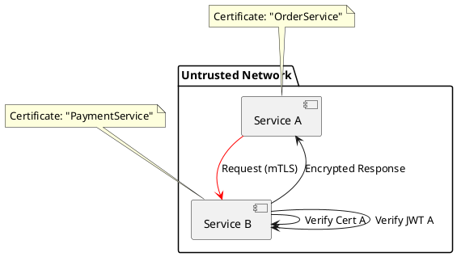

# Zero Trust Basics

**Purpose:** Explains the fundamental shift from "Perimeter Security" to the "Zero Trust" model for securing distributed services.

**Outcomes**
- Define the core pillars of Zero Trust.
- Contrast "Never Trust, Always Verify" with traditional network security.
- Implement basic mTLS and JWT validation.

---

## Overview
Traditional security relied on a "Hard Shell, Soft Center" (Perimeter) model: once you were inside the corporate network, you were trusted. In a distributed, cloud-native system, the "network" is no longer a safe place. **Zero Trust** assumes the network is compromised and verifies every single request.

## The Core Pillars

### 1. Identify-Based Security
Trust is based on the identity of the service or user, not their IP address.
- **Service Identity:** Often managed via SPIFFE/Spire or cloud-managed identities.

### 2. Micro-Segmentation
Breaking the network into small, isolated segments to limit "Lateral Movement" if a service is compromised.

### 3. Mutual TLS (mTLS)
Both the client and server present certificates and verify each other's identity. This ensures all traffic is encrypted and authenticated.

---

## JWT and Authentication
**JSON Web Tokens (JWT)** allow services to pass verifiable user identity and permissions between services without needing to re-authenticate at every step.

---

## Code Examples

### Java: JWT Verification
```java
// Simplified JWT validation at a service boundary
public void filter(Request req) {
    String token = req.header("Authorization");
    if (!jwtParser.verify(token, publicKey)) {
        throw new UnauthorizedException();
    }
}
```

### Go: mTLS Server Configuration
```go
// Basic server forcing mutual authentication
tlsConfig := &tls.Config{
    ClientAuth: tls.RequireAndVerifyClientCert,
    ClientCAs:  trustedCA,
}
server := &http.Server{ TLSConfig: tlsConfig }
```

### Python: Decoding Service-to-Service Identity
```python
def get_caller_identity(request):
    # mTLS usually puts the service identity in the certificate
    cert = request.get_peer_certificate()
    return cert.get_subject().commonName
```

---

## Design Diagram



## Risks and Tradeoffs
- **Complexity:** Managing a Private Key Infrastructure (PKI) for thousands of services is a massive operational burden.
- **Latency:** Certificate handshake (mTLS) and token verification add latency to every request.
- **Centralization:** While identity is distributed, the "Root of Trust" (Certificate Authority) is a critical single point of failure.
- **Token Leakage:** If a JWT is stolen, an attacker can impersonate a user/service until the token expires.
