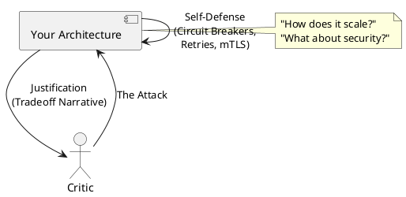

# Architecture Defense Prep

**Purpose:** Prepares students to present and justify complex distributed system designs to diverse stakeholders, including architects, developers, and product managers.

**Outcomes**
- Construct a visual representation of a distributed system that "tells a story."
- Anticipate and address common architectural critiques (Reliability, Security, Scale).
- Apply "Steel-manning" to the alternative designs to strengthen the final defense.

---

## Overview
Defending an architecture is not about being "right"; it's about showing that you have considered all the relevant variables. A senior architect must be able to explain how their design meets the business goals while managing technical debt.

## Core Elements of a Defense

### 1. The Story
Every design has a narrative. "We started with a monolith, hit a scaling bottleneck in the Order Service, and decided to move to an event-driven model to ensure the UI remains responsive during high load."

### 2. The "Happy Path" vs "The Chaos"
Don't just show how the system works when everything is fine. Show how it fails.
- What happens when the message bus is down?
- How do we recover from a corrupted database state?
- Where is the single point of failure?

### 3. Addressing the "Sacred Cows"
Be prepared to defend decisions that go against the company "norm" (e.g., "I know we are a Java shop, but for this specific high-performance proxy, we chose Go because of its lower memory footprint").

---

## Common Critique Themes

| Theme | Critique | Best Defense |
| :--- | :--- | :--- |
| **Reliability** | "What if Service A is down?" | "We use a circuit breaker and fallback to a cached response." |
| **Consistency** | "Users will see stale data!" | "The delay is <1s, and we use optimistic UI for the primary user." |
| **Security** | "Is this JWT secure?" | "We verify the signature at every service and use mTLS internally." |
| **Cost** | "This looks expensive!" | "Auto-scaling and tiered storage keep the monthly cost within budget." |

---

## Code Examples

### Java: Circuit Breaker with Fallback (Resilience4j)
```java
// Showing how the system handles failure is a key part of defense
@CircuitBreaker(name = "backend", fallbackMethod = "fallback")
public String callBackend() {
    return restTemplate.getForObject("/api", String.class);
}

public String fallback(Throwable t) {
    return "Cached response (System is in degraded mode)";
}
```

### Go: Context Timeout (Defending against "Slow APIs")
```go
// Defending against latent dependencies
ctx, cancel := context.WithTimeout(context.Background(), 2*time.Second)
defer cancel()

req, _ := http.NewRequestWithContext(ctx, "GET", "http://slow-api", nil)
```

### Node.js: Input Validation (Defending against "Malicious Data")
```javascript
// Proving that the edge is secure
const schema = Joi.object({
    userId: Joi.string().guid().required(),
    amount: Joi.number().min(0).max(10000).required()
});
const { error } = schema.validate(req.body);
```

---

## Design Diagram



## Risks and Tradeoffs
- **Over-engineering:** Defending against "every possible failure" can lead to a system that is too complex to build.
- **Cognitive Bias:** Architects often fall in love with their own designs (Confirmation Bias).
- **Communication Gap:** Failing to translate technical benefits into business value (e.g., "It has 99.99% uptime" vs "It won't crash during the Black Friday sale").
