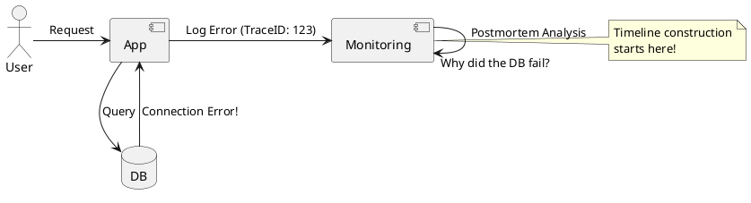

# Failure Postmortems

**Purpose:** Provides a framework for analyzing system outages in a way that maximizes learning and avoids individual blame.

**Outcomes**
- Define the "Blameless Postmortem" philosophy.
- Identify the difference between Proximate and Root causes.
- Implement a structured postmortem document.

---

## Overview
Failures in a distributed system are inevitable. What separates high-performing teams is how they handle failure. A postmortem is not a trial; it is a clinical analysis of a system failure to prevent it from happening again.

## Core Concepts

### 1. The Blameless Philosophy
Focus on the *system* and its *processes*, not the individual who "pushed the button." If one person can take down the system, it's a system failure, not a human failure.

### 2. Five Whys
A technique used to explore the cause-and-effect relationships underlying a particular problem. By repeating "Why?", you can peel away layers of symptoms to find the root cause.

### 3. Proximate vs. Root Cause
- **Proximate Cause:** The immediate event (e.g., "The disk was full").
- **Root Cause:** The fundamental issue (e.g., "Our monitoring failed to alert us when disk space reached 90%, and we lacked an automated cleanup policy").

---

## The Postmortem Structure

| Section | Content |
| :--- | :--- |
| **Summary** | High-level overview of what happened and the impact. |
| **Timeline** | Minute-by-minute account of detection, response, and resolution. |
| **Root Cause** | The deep architectural or process failure identified. |
| **Action Items** | Concrete tasks to prevent recurrence (assigned to teams). |
| **Lessons Learned** | What went well? What went wrong? Where did we get lucky? |

---

## Code Examples

### Python: Automating "Postmortem" Data Collection
```python
# Script to capture system state immediately after a failure
def capture_diagnostics():
    logs = cloudwatch.get_logs(last_30_mins=True)
    metrics = prometheus.query("rate(http_errors[30m])")
    with open("failure_context.json", "w") as f:
        json.dump({"logs": logs, "metrics": metrics}, f)
```

### Go: Standardized Error Wrapping (for better RCA)
```go
// Wrapping errors with context makes root cause analysis much easier
if err != nil {
    return fmt.Errorf("failed to process payment for order %s: %w", orderID, err)
}
```

### Java: Structured Logging for Auditing
```java
// Including correlation IDs in every log makes timeline construction easy
log.info("Starting saga step", 
    StructuredArguments.kv("traceId", traceId),
    StructuredArguments.kv("step", "PAYMENT_RESERVATION")
);
```

---

## Design Diagram



## Risks and Tradeoffs
- **Time Sink:** Writing a good postmortem is time-consuming. You must decide on a "Severity Threshold" (e.g., P0/P1 only).
- **Fear:** If the culture isn't truly blameless, people will hide their mistakes, leading to more failures.
- **Action Item Drift:** Often, the action items from a postmortem are never completed because "new feature work" takes priority.
