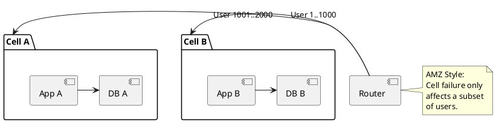

# Industry Patterns

**Purpose:** Explores how major tech companies apply the patterns and principles discussed throughout the semester at an extreme scale (Netflix, Uber, Amazon).

**Outcomes**
- Identify real-world implementations of Sagas, Circuit Breakers, and mTLS.
- Contrast the different "Scaling Philosophies" of tech giants.
- Analyze the evolution of a distributed system from a monolith to a globally distributed mesh.

---

## Overview
What works for a startup won't work for Netflix. At the scale of millions of requests per second, even a 0.001% error rate is a major problem. This lecture looks at the industry standard "blueprints" for extreme-scale distributed systems.

## Core Case Studies

### 1. Amazon: The "Cell-Based Architecture"
Instead of one giant cluster, Amazon partitions its infrastructure into independent "Cells." A failure in one cell (e.g., an AZ) never affects another.
- **Pattern:** Fault Isolation (Bulkheads).

### 2. Netflix: The "Chaos Monkey"
Netflix doesn't wait for things to break; they break things on purpose. By injecting failure into production, they ensure their resilience patterns (Circuit Breakers) actually work.
- **Pattern:** Chaos Engineering.

### 3. Uber: The "Domain-Oriented Microservices" (DOMA)
Uber moved from thousands of microservices to "Domains" to reduce complexity. Each domain has an "Interface" service that hides the internal complexity of its microservices.
- **Pattern:** API Composition / Facade.

---

## Industry Standard Tools (The Ecosystem)

| Category | Standard Tool(s) | Role |
| :--- | :--- | :--- |
| **Orchestration** | Kubernetes | Managing container lifecycles. |
| **Messaging** | Kafka / Pulsar | High-throughput event logs. |
| **Observability** | Prometheus / Jaeger | Metrics and tracing. |
| **Service Mesh** | Istio / Linkerd | Internal security and traffic control. |

---

## Code Examples

### Java: Netflix Hystrix (Legacy/Classical Pattern)
```java
// The original "Industry Standard" for Circuit Breakers
public class CommandWithFallback extends HystrixCommand<String> {
    protected String run() {
        return callExternalService();
    }
    protected String getFallback() {
        return "Fallback response";
    }
}
```

### Go: Uber-style Domain Interface (Simplified)
```go
// DOMA: All external calls go through this Gateway
type UserDomainGateway struct {
    authService    AuthClient
    profileService ProfileClient
}

func (g *UserDomainGateway) GetUserProfile(id string) UserProfile {
    // Orchestrates internal services
}
```

### Python: AWS-style Cell-Based Routing (Logic)
```python
def get_service_endpoint(user_id):
    # Route user to their assigned "Cell" to limit blast radius
    cell_id = user_id % TOTAL_CELLS
    return f"https://cell-{cell_id}.api.acme.com"
```

---

## Design Diagram



## Risks and Tradeoffs
- **Complexity Overhead:** Tools like Kafka or Kubernetes require a dedicated team to manage (Operational Tax).
- **Cost of Resilience:** Running 3 copies of everything across 3 AZs doubles your infrastructure bill.
- **The "Netflix Fallacy":** Thinking your startup needs the same architecture as Netflix before you have the same scale (Over-engineering).
